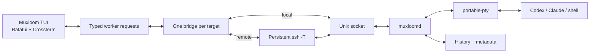

<div align="center">

# Muxloom

**A terminal-native workspace for persistent Codex, Claude Code, and shell sessions across local and SSH machines.**

[English](./README.md) · [中文](./README.zh-CN.md) · [Releases](https://github.com/MarsTechHAN/Muxloom/releases) · [CI](https://github.com/MarsTechHAN/Muxloom/actions/workflows/regression.yml)

[](https://github.com/MarsTechHAN/Muxloom/actions/workflows/regression.yml)
[](https://github.com/MarsTechHAN/Muxloom/releases)


</div>

> [!IMPORTANT]
> Muxloom manages terminal sessions; it does not replace Codex or Claude Code.
> Those CLIs run normally on the selected target. A detached `muxloomd` process
> owns each managed PTY, so closing the dashboard or losing SSH never stops the
> agent.

## Contents

- [Why Muxloom](#why-muxloom)
- [Features](#features)
- [Feature tour](#feature-tour)
- [Install](#install)
- [Quick start](#quick-start)
- [Controls](#controls)
- [Configuration](#configuration)
- [How it works](#how-it-works)
- [Platform support](#platform-support)
- [Troubleshooting](#troubleshooting)
- [Limitations and security](#limitations-and-security)
- [Contributing](#contributing)
- [License](#license)

## Why Muxloom

Running several coding agents across folders and machines usually means a wall
of SSH tabs and `tmux` windows, and a dropped connection can take a running
agent with it. Muxloom is a single Rust TUI that keeps that working set in one
place: a machine pane, a folder-grouped session pane, and an embedded terminal,
all backed by a daemon that owns the real PTYs.

It brings together:

- SSH targets from `~/.ssh/config` plus the local machine;
- persistent **Codex**, **Claude Code**, and ordinary **shell** sessions;
- resumable histories, recaps, archive, global search, and attention alerts;
- a remote file browser with syntax-highlighted text, image, and video previews;
- responsive landscape, portrait, and compact layouts with persistent splits.

Managed sessions are owned by `muxloomd` and do not appear in `tmux ls`. Each
target is reached over a single multiplexed bridge that carries control
messages, PTY traffic, history pages, file operations, and encoded media.

## Features

- 🗄️ **Multi-machine** — one dashboard for local and SSH targets; enable a host
  and Muxloom probes and provisions it over the existing connection.
- 🔌 **Survives disconnects** — `muxloomd` owns the PTY, so quitting the
  dashboard or losing SSH leaves the agent running.
- 🚀 **Start & resume** — a New/Resume flow with a fuzzy path picker that reads
  Codex and Claude Code session metadata to resume the right history.
- 📁 **Remote file browser** — browse, filter, preview, download, and
  drag-to-upload, with syntax highlighting, Markdown, JSON/JSONL/CSV, images,
  and video decoded on the controller.
- ⌨️ **Real terminal** — a `vt100` emulator with true scrollback, text
  selection, mouse reporting, and bracketed paste.
- 🔍 **Search, recap & archive** — ranked full-text search across live and
  archived sessions, per-session recaps, and a searchable archive.
- 🔔 **Attention alerts** — approval and input prompts raise a clickable banner,
  the bell, and desktop notifications.
- 🧭 **Responsive layout** — landscape, portrait, and compact modes that follow
  the rendered geometry, with independently persisted split ratios.

## Feature tour

### 🗄️ Machines and targets

The Machines pane lists the local host and concrete aliases from your SSH
config. Enabling a target authorizes periodic BatchMode probing; disabled
targets are never touched.

**Keys** — `Space` enable/disable · `Ctrl-r` refresh · `v` hide disabled hosts ·
click a checkbox.

### 🚀 Start and resume agents

`n` opens the New/Resume flow. Pick a runtime and a working directory with the
fuzzy path picker, then start fresh or resume a history discovered in that exact
folder. Resume candidates come from Codex (`~/.codex/sessions`) and Claude Code
(`~/.claude/projects`), and expand to show a recap.

**Keys** — `n` open · type to fuzzy-match a folder · `Left`/`Right` navigate ·
`Enter` confirm.

### 🧭 Responsive layout

Panes follow the rendered geometry: landscape places navigation beside the
terminal, portrait stacks the terminal above the sidebars, and a compact mode
focuses a single pane on small screens. Focus moves with the platform modifier
plus an arrow, and the session pane toggles between folder groups and a flat
list.

**Keys** — `Alt`+arrow (macOS `Cmd`/`Option`+arrow) move focus · `Alt-1/2/3`
jump to a pane · `f` grouped/flat · drag any divider to resize.

### ✦ Working status and attention

Codex and Claude sessions animate **only** while their visible terminal is
classified as working — cyan braille dots for Codex, an orange sparkle for
Claude, both on a constant wall-clock cadence. When a session needs input it
turns Waiting, raises a clickable banner, rings the bell, and emits a desktop
notification.

**Keys** — spinners are automatic · `a` show/hide archived · click the attention
banner to jump to the session.

### ⌨️ Terminal, scrollback, and copy

Attach to any session and interact directly. Back-scroll reads the emulator's
own rendered scrollback, so live-redrawing TUIs stay readable instead of
collapsing into a linearized log, and the daemon replays retained output on
attach so scrollback survives relaunching the controller. Drag to select and
copy — while scrolled back, and while the file browser is open.

**Keys** — `Enter` attach · `PageUp`/`PageDown` or wheel scroll · drag to select
· `Cmd`/`Ctrl+C` copy · `Shift`/`Option+Enter` newline.

### 📁 File browser and previews

`Ctrl-f` opens Files at the selected session's folder. Browse and filter
entries, then preview text with `syntect` highlighting, Markdown, JSON/JSONL,
CSV/TSV tables, images (truecolor half-blocks), and video (encoded bytes
streamed to controller-side FFmpeg). Media stays encoded across SSH; the target
never sends expanded RGB frames.

**Keys** — `Ctrl-f` open/close · type to match · `Enter`/`Right` open · `Left`
up · `d` download · `c` copy path · drag preview text to copy · drag local files
in to upload.

### 🔍 Search, recap, and archive

`/` searches every enabled target's history — live and archived — ranked by
label and folder, then recap, then remaining history. Each session carries a
recap line, and archived agents stay searchable and resumable.

**Keys** — `/` or `Ctrl-p` search · `Enter` jump to a result · `x`
archive/delete · `a` show archived.

## Install

### Release bundle

Download the controller archive from
[GitHub Releases](https://github.com/MarsTechHAN/Muxloom/releases). Keep the
extracted directory together — `muxloom` discovers the bundled `muxloomd`,
cross-platform companions, and FFmpeg relative to its own executable. Each
archive and companion asset ships a matching `.sha256`.

```bash
chmod +x muxloom muxloomd ffmpeg companions/*/muxloomd
./muxloom init
./muxloom
```

On Windows, run `muxloom.exe`; it manages SSH targets. The current Windows
bundle does not provide a local `muxloomd`.

### Build from source

Requires Rust 1.85+, `ssh` for remote targets, `curl` when the controller must
fetch a companion or agent package, and `ffmpeg` on `PATH` (or `MUXLOOM_FFMPEG`)
for video preview.

```bash
git clone https://github.com/MarsTechHAN/Muxloom.git
cd Muxloom
cargo build --release
./target/release/muxloom init
./target/release/muxloom
```

### Command line

```text
muxloom [--config PATH] [--debug | --debug-log PATH]
muxloom init [--config PATH]
```

| Option | Purpose |
| --- | --- |
| `-h`, `--help` | Show command-line help |
| `-V`, `--version` | Show the Muxloom version |
| `--config PATH` | Use a custom TOML configuration |
| `--debug` | Write detailed logs to the default state directory |
| `--debug-log PATH` | Write detailed logs to an explicit file |

`muxloom init` refuses to overwrite an existing configuration.

## Quick start

1. Start `muxloom`. The local target is enabled by default; SSH aliases appear
   in Machines.
2. Select an SSH target and press `Space` (or click its checkbox) to enable it.
3. Press `n`, choose Codex / Claude / Terminal, a working directory, and an
   optional label.
4. Choose **New session**, or resume a history discovered in that exact folder.
5. Press `Enter` or click the terminal to interact; move focus with the platform
   modifier plus an arrow, or click **Back**.
6. Press `q` to leave — managed sessions keep running.

If Codex or Claude is missing, the New flow asks before installing it; if the
target companion is missing or stale, the controller provisions the matching
binary automatically over the existing SSH connection.

## Controls

The footer shows the most useful actions for the current context. Press `?` for
the full categorized help inside the TUI.

### Navigation and sessions

| Key | Action |
| --- | --- |
| macOS `Cmd+Arrow` / `Option+Arrow` | Move focus to the visible neighboring pane |
| Windows/Linux `Alt+Arrow` | Move focus to the visible neighboring pane |
| `Alt-1`, `Alt-2`, `Alt-3` | Focus Machines, Agents, or Terminal |
| `Up` / `Down`, `j` / `k` | Move the current selection |
| `Space` in Machines | Enable or disable a target |
| `n`, `Ctrl-n` | Start the New/Resume flow on the selected target |
| `Enter` | Open the selected terminal or confirm the current form |
| `x` | Archive a live agent; delete an already archived agent |
| `a` | Show or hide archived agents |
| `/`, `Ctrl-p` | Search all discovered session histories |
| `Ctrl-f` | Open or close Files in the current context |
| `,` / `Ctrl-,` | Edit the selected machine's / global configuration |
| `f` | Toggle grouped and flat session views |
| `v`, `Ctrl-h` | Hide disabled machines or show all |
| `r`, `Ctrl-r` | Refresh enabled targets |
| `?` / `q` | Open help / exit without stopping managed sessions |

Focus shortcuts follow the rendered geometry; unmodified arrows stay available
to the application while terminal input is active.

### Terminal input and history

| Key or gesture | Action |
| --- | --- |
| Text, paste, and normal key chords | Forward to the focused PTY |
| `Shift+Enter`, `Option+Enter` | Insert a newline without submitting |
| `Ctrl-c`, `Ctrl-d` | Forward to the agent or shell |
| `PageUp`, `PageDown` | Move through terminal scrollback by a viewport |
| Mouse wheel over terminal | Move scrollback continuously in one-line steps |
| Drag over terminal text | Copy the selection on mouse release |
| `Alt` + drag | Forward mouse drag to a terminal application |

### File browser

| Key or gesture | Action |
| --- | --- |
| `Up` / `Down`, `j` / `k` | Select an entry |
| Type text | Match entries in the current directory |
| `Right`, `Enter`, double-click | Enter a directory or toggle Preview |
| `Left`, right-click | Go to the parent directory |
| Arrows, `PageUp` / `PageDown` | Page an opened preview |
| `g` / `G`, `Home` / `End` | Jump to preview start or end |
| `c` | Copy the selected target-side full path |
| Drag over preview text | Copy the selected preview text on release |
| `d` | Download the selected file to `~/Downloads` |
| Drag local files in | Upload them to the browsed directory |
| `r`, `F5` | Refresh the current directory |
| `Esc` | Close Preview, then clear a query, then close Files |

Clicking a pane focuses it; checkboxes, session rows, Archive, Back, and the
attention banner are clickable. When the embedded program enables mouse
reporting, Muxloom forwards encoded mouse events unless the gesture is reserved
for text selection.

## Configuration

The default file is `~/.config/muxloom/config.toml`; a missing file is valid and
uses built-in defaults. UI state (enabled machines, layout splits, grouped/flat
mode, archive visibility) is stored separately in
`~/.local/state/muxloom/state.json`.

```toml
refresh_interval_ms = 5000
ssh_connect_timeout_secs = 5
history_limit = 1000000
history_chunk_lines = 500
ssh_config = "~/.ssh/config"

attention_patterns = [
  "do you want to",
  "would you like to",
  "allow command",
  "approve",
  "waiting for your input",
  "press enter to confirm",
]

# Shell-style NAME=value assignments, injected into installs and launches.
environment = ""
reverse_tunnel = ""

# Target command and optional controller-side companion asset.
companion_command = "muxloomd"
companion_binary = ""

[agents.codex]
command = "codex"
args = []
install = "curl -fsSL https://chatgpt.com/codex/install.sh | sh"
sync_files = ["~/.codex/config.toml", "~/.codex/auth.json"]

[agents.claude]
command = "claude"
args = []
install = "curl -fsSL https://claude.ai/install.sh | bash"
sync_files = ["~/.claude/settings.json"]

# Empty means the target user's SHELL, then /bin/sh.
[agents.terminal]
command = ""
args = []

# Overrides use an exact SSH Host alias or "local".
[hosts.gpu-box]
environment = 'HTTP_PROXY=http://127.0.0.1:18118 HTTPS_PROXY=http://127.0.0.1:18118'
reverse_tunnel = "18118:127.0.0.1:8118"
attention_patterns = ["gpu approval", "do you want to proceed"]

[hosts.gpu-box.codex]
command = "/opt/codex/bin/codex"
args = ["--full-auto"]
```

- `command` is one executable name or path; `args` are structured values, not a
  shell string. Use a wrapper executable for pipes or redirects.
- `environment` uses shell-style assignments
  (`HTTP_PROXY=http://proxy:8118 TOKEN='two words'`). Global values merge with
  the selected machine's overrides.
- `reverse_tunnel` is `REMOTE_PORT:LOCAL_HOST:LOCAL_PORT`; the remote runtime can
  then reach `127.0.0.1:REMOTE_PORT` while traffic exits through the controller.
- `sync_files` are copied from the controller user's home to the same relative
  target paths, backing up existing files. Histories are never synced.
- Edit these live: `,` for the selected machine, `Ctrl-,` for global defaults.
  Settings fields use shell-word syntax rather than JSON.

## How it works



**Persistence.** `muxloomd` directly owns each PTY and child process; the
dashboard and SSH bridge are subscribers, so either can disconnect without
terminating the session. The daemon keeps append-only ANSI history on the
target and replays retained output on attach.

**Transport.** Each remote target uses one long-lived, non-PTY SSH process. A
framed protocol multiplexes request and stream IDs over it, completing requests
out of order with stream-credit backpressure and heartbeats; large payloads use
LZ4 only when useful. Companion bootstrap compares SHA-256 fingerprints computed
by the Rust binaries and ships a missing or stale binary atomically over the
same SSH stdin. Daemon replacement is non-disruptive: a new binary cannot
replace a daemon that owns live PTYs, so the old generation serves the
compatible protocol until idle, then drains and exits.

**Terminal rendering.** `vt100::Parser` maintains alternate-screen state,
cursor, colors, styles, mouse mode, application cursor keys, bracketed paste,
and scrollback. Switching sessions keeps the old frame visible until the new
stream produces its first frame.

### Source map

| Module | Responsibility |
| --- | --- |
| `src/main.rs` | CLI, terminal guards, signals, event loop, notifications |
| `src/app.rs` | State machine, focus, forms, retries, input routing |
| `src/ui.rs` | Responsive layouts, widgets, VT cells, preview rendering |
| `src/worker.rs` | Background typed request/event execution |
| `src/runtime.rs` | Launch, discovery, installation, compatibility backend |
| `src/bridge.rs` | Persistent connections, bootstrap, multiplexed streams |
| `src/daemon_protocol.rs` | Frames, compression, request/stream types |
| `src/daemon.rs` | PTY supervisor, history, archive, files, search |
| `src/bin/muxloomd.rs` | Companion `serve`, `bridge`, and `status` commands |
| `src/terminal_session.rs` | Live parser, input encoding, resize safety |
| `src/media.rs` | Image/video decode and playback updates |

## Platform support

| Platform | Controller | Local managed sessions | SSH targets |
| --- | --- | --- | --- |
| Linux x86_64 | Yes | Yes | Yes |
| macOS Apple Silicon | Yes | Yes | Yes |
| macOS Intel | Yes | Yes | Yes |
| Windows x86_64 | Yes | Not yet | Yes |

Release bundles include controller-side FFmpeg and companion binaries for Linux
x86_64, macOS Apple Silicon, and macOS Intel. A target normally needs only a
POSIX shell and SSH access for bootstrap; afterward, managed PTY, history,
search, probing, and file operations run through the Rust companion.

## Troubleshooting

Start with an explicit log:

```bash
muxloom --debug-log /tmp/muxloom-debug.log
```

- **Target stays offline** — run `ssh -T -o BatchMode=yes <alias> true`, then
  read the bridge bootstrap error in the log.
- **Remote renders but ignores input** — confirm `connected ... via one
  persistent bridge` and `terminal first frame ready`, with no later `EOF`.
- **Working animation missing** — look for both `source=live-terminal` and
  `source=muxloomd` activity records and verify the companion fingerprint updated.
- **Portrait renders horizontally** — inspect the `layout` pixel/cell dimensions;
  some outer terminals do not report pixel size.
- **Attention too broad** — inspect the matched reason and visible tail, then
  narrow that machine's `attention_patterns`.
- **Video will not decode** — verify the bundled `ffmpeg`, `MUXLOOM_FFMPEG`, or
  an `ffmpeg` on the controller `PATH`.

> [!WARNING]
> Debug logs can contain small excerpts from the visible agent screen. Treat
> them as potentially sensitive.

## Limitations and security

- Direct Codex-to-Claude history conversion is not implemented; their private
  event formats are independent.
- Windows controls remote targets but does not host local managed sessions.
- Audio playback and interactive video seek/volume controls are not implemented.
- Resume discovery depends on the current Codex and Claude Code metadata formats.
- Attention detection is heuristic; keep machine-specific patterns narrow.
- Enabling a target authorizes periodic BatchMode SSH access and companion
  management for that alias. Target history and search results can contain
  sensitive content.
- Muxloom adds no permission-bypass arguments by default; configured runtime
  flags keep the security consequences of that runtime.

## Contributing

Issues and pull requests are welcome. Before opening a PR, run the same checks
CI does:

```bash
cargo fmt --all -- --check
cargo clippy --locked --all-targets -- -D warnings
cargo test --locked --all-targets -- --test-threads=1
```

## License

Muxloom is distributed under the
[GNU General Public License v3.0 only](./LICENSE).
