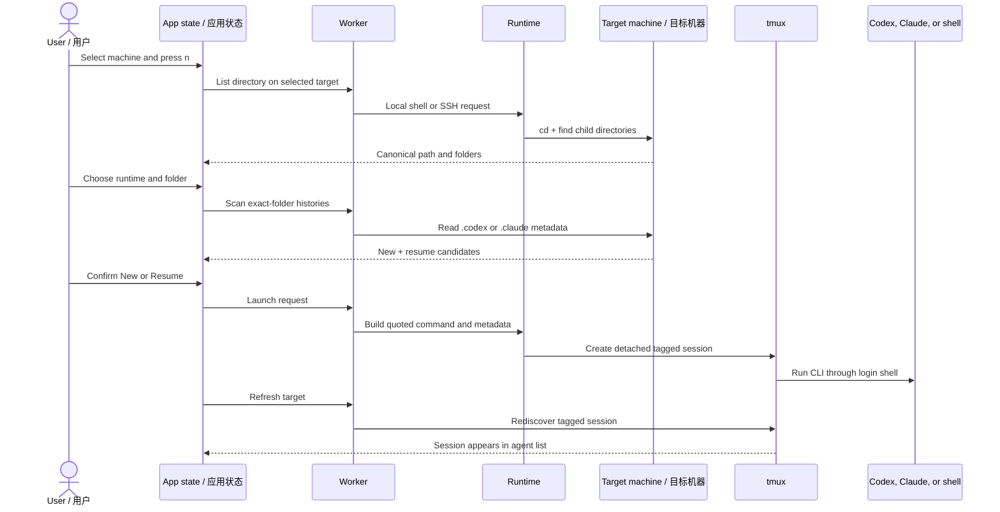
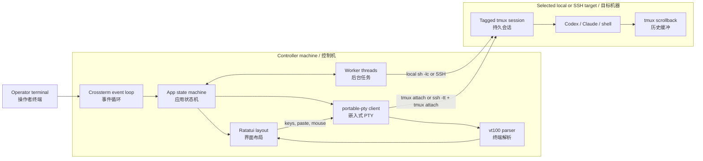

# Muxloom

<p align="center">
  A terminal-native control plane for persistent Codex, Claude Code, and shell sessions across local and SSH machines.
</p>

<p align="center">
  <a href="#english">English</a> ·
  <a href="#chinese">中文</a> ·
  <a href="#en-quick-start">Quick Start</a> ·
  <a href="#en-architecture">Architecture</a> ·
  <a href="#en-keyboard">Key Map</a>
</p>

<p align="center">
  <a href="https://github.com/MarsTechHAN/Muxloom/actions/workflows/release.yml"></a>
  <a href="https://github.com/MarsTechHAN/Muxloom/releases"></a>
  
  
  
  
</p>

> [!IMPORTANT]
> `muxloom` is a session manager and terminal renderer. Codex and Claude Code
> still run as their normal CLI applications on the selected target machine.
> Persistence comes from tmux on that machine, not from a hosted agent service.

---

<a id="english"></a>

## English

### Contents

- [Overview](#en-overview)
- [Why Muxloom](#en-why)
- [Quick start](#en-quick-start)
- [Automated builds and releases](#en-releases)
- [First-run workflow](#en-first-run)
- [Layout and interaction model](#en-layout)
- [Launching, browsing, and resuming](#en-launch-flow)
- [Keyboard map](#en-keyboard)
- [Mouse controls](#en-mouse)
- [Machines and SSH](#en-machines)
- [Configuration](#en-configuration)
- [File manager](#en-file-manager)
- [History, search, archive, and attention](#en-history)
- [Runtime model](#en-runtime-model)
- [Architecture](#en-architecture)
- [Reliability and terminal correctness](#en-reliability)
- [Files and state](#en-files)
- [Upgrading from agent-deck](#en-upgrading)
- [Debugging and troubleshooting](#en-debugging)
- [Testing](#en-testing)
- [Current limitations](#en-limitations)
- [Security notes](#en-security)

<a id="en-overview"></a>

### Overview

`muxloom` is a Rust TUI for operating many agent sessions across many folders
and machines from one terminal. It reads SSH aliases, probes selected machines,
starts managed tmux sessions, renders the selected agent inside the dashboard,
and rediscovers those sessions after the dashboard reconnects.

The main use case is not “one chat in one directory.” It is a working set such
as:

- Codex in three repositories on a local workstation;
- Claude Code in two folders on a remote GPU or development machine;
- a normal shell beside those agents for builds, logs, and diagnostics;
- sessions that must keep running when the laptop sleeps, SSH disconnects, or
  the dashboard exits.

Only tmux sessions created by Muxloom, or by the earlier `agent-deck` builds,
are managed. New names start with `muxloom-` and carry `@muxloom_*` metadata;
legacy `ad-*` sessions and `@agentdeck_*` metadata remain discoverable.
Unrelated tmux sessions are not listed, resized, attached, or deleted.

<a id="en-why"></a>

### Why Muxloom

| Problem | What muxloom does |
| --- | --- |
| Agents are spread across machines and folders | Presents a machine list, folder-grouped agent list, and live terminal in one TUI |
| SSH disconnects stop an ordinary foreground command | Runs the real CLI inside a detached tmux session on the target |
| Attaching a full-screen CLI can take over the dashboard | Embeds a constrained PTY and renders it cell-by-cell with `vt100` and Ratatui |
| Remote agents are hard to rediscover | Scans tagged tmux metadata on every enabled target |
| Agent output is long | Keeps large tmux scrollback, caches bounded chunks locally, and retains terminal styling while scrolling |
| Remote files need inspection | Browses and previews them on the target without first downloading the file |
| Approval prompts are easy to miss | Detects current bottom-of-screen prompts and emits a banner, bell, and OSC 9 notification |
| Switching sessions flashes an empty terminal | Preloads a second PTY and swaps only after the new terminal produces its first frame |
| Every machine has a different CLI path or arguments | Supports global commands plus per-SSH-alias TOML overrides, editable in the TUI |

#### Feature summary

- Local and SSH targets loaded from `~/.ssh/config` and recursive `Include`
  files.
- Explicit machine opt-in before background probes begin.
- Codex, Claude Code, and ordinary persistent shell sessions.
- Grouped-by-folder and flat agent views.
- Local and remote folder picker with typed fuzzy ordering.
- Exact-folder Codex/Claude resume discovery.
- Optional local/remote file manager with target-side previews, path copy,
  downloads, and drag-to-upload.
- Real PTY interaction, alternate screen, 256 colors, truecolor, styled cells,
  cursor state, application cursor keys, bracketed paste, and mouse forwarding.
- Up to 1,000,000 tmux scrollback lines per managed session by default.
- Full-history search ranked as name/path, current recap, then older history.
- Two-stage local and remote archive/removal for Codex and Claude panes.
- Per-machine configuration from inside the TUI.
- Responsive landscape, portrait, and compact layouts.
- Terminal restoration on normal exit, error, panic, and termination signals.

<p align="right"><a href="#muxloom">Back to top</a></p>

<a id="en-quick-start"></a>

### Quick start

#### Requirements

Controller machine:

- macOS, Linux, or Windows;
- Rust 1.85 or newer to build;
- `ssh`/`scp` for remote targets;
- `curl` when the controller must stage a missing target-platform runtime;
- `tmux` when running local managed sessions.

The Windows build is currently intended as an SSH controller for remote
POSIX/tmux targets. Local managed sessions require tmux and are supported on
macOS and Linux.

Each remote target:

- a POSIX-compatible shell;
- tmux;
- Codex and/or Claude Code, or permission to install into the user's home;
- `tar` when Muxloom needs to upload a Codex standalone package;
- key-based or agent-based SSH authentication suitable for unattended refreshes.

The remote target does not need internet access. Controller-side staging handles
official runtime downloads before SCP upload.

#### Build and run

```bash
git clone git@github.com:MarsTechHAN/Muxloom.git
cd Muxloom
cargo build --release

# Create ~/.config/muxloom/config.toml.
# This command refuses to overwrite an existing file.
./target/release/muxloom init

./target/release/muxloom
```

For a development build:

```bash
cargo run
```

To install the current checkout into Cargo's binary directory:

```bash
cargo install --path .
muxloom
```

#### CLI options

```text
muxloom [--config PATH] [--debug]
muxloom init [--config PATH]
```

| Option | Meaning |
| --- | --- |
| `-h`, `--help` | Print CLI help |
| `-V`, `--version` | Print the version |
| `--config PATH` | Use a non-default TOML file |
| `--debug` | Log to `~/.local/state/muxloom/debug.log` |
| `--debug-log PATH` | Log to an explicit path |

<a id="en-releases"></a>

### Automated builds and releases

Every pushed `v*` tag runs formatting, Clippy, and the complete test suite,
then builds downloadable workflow artifacts for:

| Platform | Rust target | Archive |
| --- | --- | --- |
| Linux x86_64 | `x86_64-unknown-linux-gnu` | `.tar.gz` |
| macOS Apple Silicon | `aarch64-apple-darwin` | `.tar.gz` |
| macOS Intel | `x86_64-apple-darwin` | `.tar.gz` |
| Windows x86_64 | `x86_64-pc-windows-msvc` | `.zip` |

Each archive includes the executable, this README, and the GPL license. A
matching `.sha256` file is uploaded beside every archive.

Push a `v*` tag to publish the same artifacts as a GitHub Release with generated
release notes:

```bash
git tag -a v0.2.0 -m "Muxloom v0.2.0"
git push origin main
git push origin v0.2.0
```

Tags containing a hyphen, such as `v0.3.0-rc.1`, are published as prereleases.
The workflow can also be started manually from the Actions tab; manual runs
produce artifacts but never create a Release.

<a id="en-first-run"></a>

### First-run workflow

1. Start `muxloom`. The local target is enabled by default; SSH targets are
   read from the configured SSH config.
2. Select a machine. Press `Space` or click its checkbox to enable it.
3. Wait for the machine marker to become online. The second line shows detected
   Codex and Claude capabilities.
4. Press `n`. The currently selected machine is the launch target.
5. Choose Codex, Claude, or Terminal, then choose a working directory and an
   optional label.
6. Confirm `New session`, or select an exact-folder history to resume.
7. Press `Enter` or click the terminal pane to interact.
8. Use `Cmd+Arrow` or `Option+Arrow` on macOS, and `Alt+Arrow` on
   Windows/Linux, to move focus by the visible layout. You can also click
   `← Back`. The tmux client remains attached.
9. Press `q` to exit the dashboard. The tmux sessions continue running.

Machine enablement, sidebar widths, archive visibility, and grouped/flat view
are UI state. They are saved separately from the TOML configuration.

<a id="en-layout"></a>

### Layout and interaction model

#### Landscape

```text
┌──────────── Machines ────────────┬──────── Agents by folder ────────┬──────────── Live terminal ────────────┐
│ enabled targets and capabilities │ selected agent expands to show  │ full VT-rendered Codex, Claude, or   │
│                                  │ folder, recap, and status        │ shell session                         │
└──────────────────────────────────┴──────────────────────────────────┴────────────────────────────────────────┘
```

The focused sidebar grows for easier reading. Drag either landscape divider to
change the stored machine or agent width. Portrait mode has independent stored
dividers for terminal height and the lower machine/folder split.

#### Portrait

```text
┌──────────────────────────────── Live terminal ────────────────────────────────┐
│ occupies the upper 65%                                                       │
├──────────────────── Machines ─────────────────┬──────── Agents by folder ─────┤
│ lower-left                                    │ lower-right                    │
└───────────────────────────────────────────────┴────────────────────────────────┘
```

Portrait detection prefers terminal-reported pixel dimensions. If the terminal
does not report pixels, `muxloom` falls back to an approximate 1:2 cell aspect
ratio. Flat mode gives the entire lower section to the agent/folder list.

#### Compact fallback

Focus-based compact panes are used only when there is not enough space to keep
all relevant panes readable:

- portrait: fewer than 48 columns or 28 rows;
- landscape: fewer than 72 columns or 16 rows.

Focusing the terminal in compact mode makes it fill the content area. Use the
platform focus modifier plus the layout direction, or click `← Back`, to return.

<a id="en-launch-flow"></a>

### Launching, browsing, and resuming



#### Launch form

The launch form is deliberately staged:

1. **Runtime**: Codex, Claude, or Terminal.
2. **Working directory**: type a path directly or press `Enter` to browse on the
   selected target.
3. **Label**: optional display name; otherwise the folder basename is used.

Bracketed paste is accepted in launch text fields. Trailing clipboard newlines
are removed because these fields are single-line values.

#### Folder picker

| Input | Action |
| --- | --- |
| Type text | Rank child folders by prefix, substring, then forward-subsequence match |
| `Up` / `Down` | Move through matching folders |
| `Right` | Enter the selected child folder |
| `Left` | Move to the parent folder |
| `Enter` | Use the current folder |
| `Backspace` | Remove one match character |
| `Ctrl-u` | Clear the match text |
| `F5` | Refresh the current directory |
| `Esc` | Return to the launch form |

Directory listing executes on the target. Remote paths are never interpreted as
local paths.

#### New versus Resume

`New session` is always the first and default choice, even while history is
still scanning. Resume candidates are restricted to the selected runtime and
the exact canonical working directory.

- Codex metadata: `~/.codex/sessions` and
  `~/.codex/session_index.jsonl`.
- Claude metadata: `~/.claude/projects`.
- Terminal: always starts a new shell.

The selected resume entry expands to show three or four lines. A recap is used
when available; otherwise the first and last user messages are shown. Launching
a resume appends `resume <id>` for Codex or `--resume <id>` for Claude.

> [!NOTE]
> Resume discovery reads the CLI tools' current local metadata formats. Those
> formats are private implementation details and may require updates when the
> upstream tools change.

<a id="en-keyboard"></a>

### Keyboard map

#### Global and navigation

| Key | Action |
| --- | --- |
| macOS `Cmd+Arrow` / `Option+Arrow` | Move focus to the actual visible neighbor pane; Option works when the outer terminal reserves Cmd |
| Windows/Linux `Alt+Arrow` | Move focus to the actual visible neighbor pane |
| `Tab` / `Shift-Tab` | Move between fields inside forms |
| `Alt-1`, `Alt-2`, `Alt-3` | Jump to Machines, Agents, or Terminal |
| `Up` / `Down`, `j` / `k` | Move the current selection |
| `n`, `Ctrl-n` | Open the launch flow on the selected machine |
| `/`, `Ctrl-p` | Search all discovered sessions |
| `?` | Open the categorized, scrollable help window |
| `q` | Quit the dashboard without stopping agents |

macOS terminals that encode `Option+Left/Right` as the standard `Esc-b` and
`Esc-f` word-navigation sequences are handled as horizontal pane navigation.

#### Machines and sessions

| Key | Action |
| --- | --- |
| `Space` | Enable or disable the selected machine |
| `r`, `Ctrl-r` | Refresh enabled machines immediately |
| `v`, `Ctrl-h` | Hide disabled machines or show all machines |
| `f` | Toggle grouped and flat agent views |
| `Ctrl-f` | Open or close the file manager at the selected agent's folder |
| `Enter` | Open the selected live terminal |
| Unmodified arrows while interactive | Forward to the Codex/Claude/shell editor |
| `Cmd+Arrow` / `Option+Arrow` / `Alt+Arrow` | Change panes without detaching tmux |
| `x` | Stop a live agent and archive it; on an Archived agent, remove it permanently |
| `a` | Expand or collapse archived Codex/Claude panes |
| `Up` twice at the top | Jump to the first agent that currently needs input |

#### Terminal and history

| Key | Action |
| --- | --- |
| Normal text and chords | Forward directly to the focused PTY |
| `Shift+Enter`, `Option+Enter` | Insert a newline without submitting the current prompt |
| `Ctrl-c`, `Ctrl-d` | Forward to Codex, Claude, or the shell; they do not detach the dashboard |
| `PageUp` | Load an older history page |
| `PageDown` | Move toward the live terminal |
| Mouse wheel | Scroll history continuously in one-line steps |

#### Configuration

| Key | Action |
| --- | --- |
| `,` | Edit effective overrides for the selected machine |
| `Ctrl-,` | Edit global defaults |
| `Enter`, `Ctrl-s` | Save the current settings form |
| `Ctrl-u` | Clear the current settings field |

<a id="en-mouse"></a>

### Mouse controls

| Gesture | Action |
| --- | --- |
| Click a machine or agent | Focus and select it |
| Click a machine checkbox | Enable or disable that target |
| Click the terminal | Focus it and begin direct interaction |
| Click `← Back` | Return from the terminal to the agent list |
| Click the attention banner | Open the first agent waiting for input |
| Click the Archived row | Expand or collapse archived sessions |
| Drag any layout divider | Resize and persist that landscape or portrait split |
| Drag across terminal text | Select and copy immediately on mouse release |
| `Alt` + drag in terminal | Forward the drag to an application using mouse reporting |
| Wheel over the terminal | Scroll terminal history by one line |
| Wheel over a sidebar | Move by a visible page |
| Mouse inside an app that enabled mouse reporting | Forward encoded mouse events to the embedded PTY |

<a id="en-machines"></a>

### Machines and SSH

#### SSH config loading

By default, `muxloom` reads `~/.ssh/config` and recursively follows `Include`
directives. It loads concrete aliases from `Host` directives and excludes
wildcard/pattern entries such as `Host *`, `gpu-*`, negations, and character
classes because those are matching rules rather than connectable destinations.

Long aliases wrap inside the machine pane. Selecting an alias and pressing
`Space` opts it in. Disabled machines are not probed.

#### Probing and refresh behavior

For each enabled target, the runtime checks:

- whether tmux exists;
- whether the configured Codex command resolves in the login environment;
- whether the configured Claude command resolves;
- which tagged `muxloom-*` sessions (and compatible legacy `ad-*` sessions)
  exist and whether their panes are dead.

A previously online machine stays visually online through the first two
transient refresh failures so a brief SSH hiccup does not turn `2/2` into
`0/2`. It becomes offline after the third consecutive failure.

#### SSH transport

Non-interactive operations use OpenSSH in batch mode. Commands and embedded PTY
attachments from one dashboard share a ControlMaster socket under `/tmp`, which
reduces reconnect cost and works with aliases that use `ProxyCommand`, jump
hosts, custom ports, and other SSH config behavior. Each operation opens a
lightweight SSH channel over that per-machine connection rather than repeating
the TCP handshake and authentication. The master persists for ten idle minutes,
uses 15-second keepalives, and is recreated automatically after a failed health
check.

The live remote terminal is equivalent to:

```text
ssh -tt <alias> tmux attach-session -t <managed-session>
```

If that client disconnects, the target-side tmux session and agent continue.
The dashboard retries the PTY with bounded exponential backoff.

Configured reverse tunnels use a separate background SSH master, so closing the
dashboard does not immediately remove the agent's network path. If that SSH
connection later drops, the next enabled-machine scan recreates it. The debug
log records its control socket; stop it manually with
`ssh -S <control-path> -O exit <alias>` when needed.

<a id="en-configuration"></a>

### Configuration

Default configuration path:

```text
~/.config/muxloom/config.toml
```

Generate it with `muxloom init`. A missing file is also valid and uses built-in
defaults.

```toml
# Refresh and transport
refresh_interval_ms = 5000
ssh_connect_timeout_secs = 5

# tmux history allocation and TUI page size
history_limit = 1000000
history_chunk_lines = 500

# Current-screen prompt markers
attention_patterns = [
  "do you want to",
  "would you like to",
  "allow command",
  "approve",
  "waiting for your input",
  "press enter to confirm",
]

ssh_config = "~/.ssh/config"
environment = 'HTTP_PROXY=http://proxy:8118 HTTPS_PROXY=http://proxy:8118'
reverse_tunnel = ""

[agents.codex]
command = "codex"
args = []
install = "curl -fsSL https://chatgpt.com/codex/install.sh | sh"
sync_files = ["~/.codex/config.toml", "~/.codex/auth.json"]

[agents.claude]
command = "claude"
args = []
install = "curl -fsSL https://claude.ai/install.sh | bash"
sync_files = ["~/.claude/settings.json"]

# Empty command starts the target user's login shell.
[agents.terminal]
command = ""
args = []

# Optional overrides keyed by an exact SSH Host alias or "local".
[hosts.gpu-box]
# The remote connects to 127.0.0.1:18118; SSH forwards that port to the
# controller's local proxy at 127.0.0.1:8118.
reverse_tunnel = "18118:127.0.0.1:8118"
environment = 'HTTP_PROXY=http://127.0.0.1:18118 HTTPS_PROXY=http://127.0.0.1:18118'
attention_patterns = ["gpu approval", "do you want to proceed"]

[hosts.gpu-box.codex]
command = "/opt/codex/bin/codex"
args = ["--full-auto"]

[hosts.gpu-box.claude]
command = "/opt/claude/bin/claude"
args = []

[hosts.gpu-box.terminal]
command = "/bin/zsh"
args = ["-l"]
```

Commands and arguments are stored separately and shell-quoted by the runtime.
`command` must be one executable name or path, not a pipe, redirect, or compound
shell expression. Use a wrapper script when a complex launch sequence is
required.

Agent commands run through `${SHELL:-/bin/sh} -lc`, so they receive the target
user's login environment and PATH. If a tool is configured only by an interactive
shell startup file, use an absolute path or a wrapper available to the login
shell.

#### Editing configuration in the TUI

- Select a machine and press `,` to edit that machine's effective Codex, Claude,
  Terminal, and attention settings.
- Press `Ctrl-,` to edit global refresh, SSH, history, command, and attention
  defaults.
- Arguments, sync files, and attention patterns use shell-word syntax in the
  single-line fields, for example `--flag 'value with spaces'`.
- Environment is entered as shell-style assignments such as
  `HTTP_PROXY=http://proxy:8118 TOKEN='value with spaces'` and is injected into
  probing, installation, and every launched runtime.
- A per-machine reverse tunnel uses `REMOTE_PORT:LOCAL_HOST:LOCAL_PORT`. Muxloom
  keeps a background `ssh -N -R` connection, while the environment points the
  remote runtime at `127.0.0.1:REMOTE_PORT`. The remote listener is loopback-only.
  For controller-side downloads, that loopback proxy value is automatically
  translated back to `LOCAL_HOST:LOCAL_PORT`.
- Saving a machine form creates or updates `[hosts.<machine>]` in the TOML file.

#### Installing a missing runtime

When `New session` is selected and Codex or Claude is not detected, Muxloom asks
before installing. Installation is user-local and never requires `sudo`:

1. If the controller has a compatible native runtime, Muxloom uploads it to the
   target user's `~/.local` tree.
2. For a different OS/architecture, the controller downloads and SHA-256
   verifies the target-platform artifact, then transfers it with SCP. Claude is
   selected from its published release manifest; Codex uses its standalone package
   so `bwrap` and `rg` travel with the runtime. The target needs no internet.
3. Only if controller-side staging is unavailable does Muxloom run that
   machine's configured `install` command with its environment/proxy values.
4. It copies the controller's configured `sync_files` to the same paths below
   the target user's home. Existing remote files receive timestamped backups;
   missing local files are skipped.
5. It verifies the configured command and continues the original New/Resume
   launch automatically.

The defaults sync Codex `config.toml` and `auth.json`, and Claude
`settings.json`. Add relay or credential files to the per-machine `sync_files`
field when needed. Session/history directories are never part of this sync.

<a id="en-file-manager"></a>

### File manager

Press `Ctrl-f` to open the file manager. It starts in the selected agent's
folder; when no agent is selected, it starts at `.` on the selected machine.
The Agents-by-folder pane becomes a Files sidebar while the terminal remains
visible. Opening a file switches the terminal pane to Preview; opening the same
file again restores the live terminal. The browser works the same way for local
and SSH targets:

| Key or gesture | Action |
| --- | --- |
| `Up` / `Down`, `j` / `k` | Select a directory or file |
| `Right`, `Enter` | Enter a directory; on a file, toggle its preview |
| `Left` | Go to the parent directory |
| `PageUp` / `PageDown` | Scroll the preview |
| `c` | Copy the selected file's full target-side path to the clipboard |
| `d` | Download the selected file to the controller's `~/Downloads` directory |
| Drag local files into the terminal | Upload them to the directory currently being browsed |
| Drag the Files/Preview divider | Resize and persist the file-sidebar split independently |
| `r`, `F5` | Refresh the directory |
| `Esc`, `Ctrl-f` | Close the file manager |

Directory enumeration, MIME detection, bounded text reads, and media metadata
inspection all execute on the target machine. Text detection is content-based,
so Python files and extensionless scripts still preview; a missing target-side
`file` utility produces no placeholder noise. Text and Markdown previews are
limited to 256 KiB. Markdown renders `#` through `####`, `**bold**`, lists,
quotes, fenced code, tables, and horizontal rules. Audio and video files show
`ffprobe` metadata when available. Binary files are never rendered as terminal
bytes.

Opening a preview does not create a local copy. A transfer happens only after
`d`, or when local paths pasted by the outer terminal's file-drop operation are
uploaded through SCP. The `c` action copies the canonical path reported by the
target, using the native clipboard on macOS/Windows and OSC 52 as the portable
terminal fallback.

Directory requests do not lock navigation. Cached entries remain selectable
while Loading is visible; Left can move to the parent and Right can return to
the child just left. Results from stale paths are ignored, and every selection,
directory, refresh, or preview close clears the old preview state.


<a id="en-history"></a>

### History, search, archive, and attention

#### History paging

The live PTY parser only needs the visible screen. Long-term history stays in
tmux on the target. `PageUp` and `PageDown` move by a viewport while the wheel
moves by one line. Muxloom fetches larger bounded chunks, reuses them for
small scroll steps, and saves fetched chunks under its local state directory.
Offsets are clamped to tmux's actual `history_size`; loading keeps the current
terminal frame visible instead of rendering an empty out-of-range page. It never
loads the full one-million-line allocation at once.

History capture asks tmux to retain SGR attributes. The history renderer then
reconstructs basic, 256-color, and truecolor foreground/background colors plus
bold, dim, italic, underline, reverse, and crossed-out text. Scrolling therefore
keeps the same semantic highlighting instead of falling back to plain text.

History capture reads the pane's actual dimensions and never resizes tmux.
Sidebar drag resize is deferred until mouse release, preventing capture and PTY
clients from racing over pane dimensions.

#### Full search

Press `/` or `Ctrl-p` to search all discovered local and remote sessions,
including archived panes. Results are ranked:

1. optional label, display name, or folder path;
2. current recap/visible pane;
3. older tmux history.

Opening an archived result expands the archive automatically.

#### Archive

`remain-on-exit` keeps an agent pane after its process exits. Discovery also
retrofits this option onto older managed sessions. It maps a
dead Codex or Claude pane to an archived session for both local and remote
targets. Archived sessions are collapsed by default but remain searchable and
readable. Opening one scans the matching runtime history for that machine and
folder, then directly resumes the newest candidate. If no resumable history is
found, the final terminal output remains available read-only.

Ordinary Terminal panes are not archived. Once their shell exits, the next scan
removes the dead tmux session and drops it from the list.

Pressing `x` on a live Codex or Claude agent stops its process and leaves its
pane in Archived. Pressing `x` again while that Archived row is selected fully
removes the tmux session and its tmux history. Ordinary Terminal panes skip the
archive stage: `x`, or a shell exit, removes them directly.

#### Attention and notifications

Attention detection inspects only the bottom physical rows of the current
screen. It recognizes known Codex/Claude approval layouts and configurable
markers. A bare normal prompt such as `› Explain this codebase` is not enough;
generic choices require an explicit question and short current option rows.

When a session newly needs input:

- the header shows a yellow clickable banner;
- the agent row is marked as waiting;
- the outer terminal receives a bell and OSC 9 notification;
- the event is deduplicated until the prompt clears and reappears.

Only a Codex or Claude agent whose current screen reports active work animates.
Codex uses a cyan single-cell cycle and Claude uses its yellow `✻`/`✽`/`✶`/`✳`
cycle; the same runtime indicator animates in Machines. Idle, Terminal, waiting,
and Archived sessions do not animate.

<a id="en-runtime-model"></a>

### Runtime model



The dashboard is not the owner of the long-running process. tmux on the target
is. The dashboard owns only discovery requests and an attached client PTY. This
is why quitting or losing SSH does not terminate the agent.

#### Managed tmux lifecycle

Launching creates a uniquely named detached session:

```text
muxloom-<runtime>-<unix-time>-<dashboard-pid>-<sequence>
```

The runtime then:

1. sets the configured `history-limit`;
2. creates an `agent` window in the requested working directory;
3. enables `remain-on-exit`;
4. disables the tmux status line for clean embedding;
5. enables tmux mouse support;
6. writes runtime, path, label, and creation-time metadata;
7. starts the quoted Codex, Claude, or shell command.

Any later `muxloom` process can rediscover that session from its name and
metadata.

<a id="en-architecture"></a>

### Architecture

The implementation intentionally separates UI state, asynchronous work,
transport/runtime operations, and terminal emulation.

| Module | Responsibility |
| --- | --- |
| `src/main.rs` | CLI parsing, terminal enter/leave, panic and signal guards, event loop |
| `src/app.rs` | State machine, focus, modal workflows, selection, retries, persistence, input routing |
| `src/ui.rs` | Ratatui rendering, responsive layout, VT cell rendering, hit regions |
| `src/model.rs` | Targets, probes, sessions, history pages, search, resume, and file records |
| `src/config.rs` | TOML defaults, per-host overrides, JSON UI state, standard paths |
| `src/ssh_config.rs` | Concrete SSH alias and recursive `Include` parsing |
| `src/worker.rs` | Request/event channels and background threads for blocking operations |
| `src/runtime.rs` | Local/SSH commands, tmux lifecycle, discovery, history, search, resume scanning, file operations, attention detection |
| `src/terminal_session.rs` | PTY creation, tmux attach, VT parser, key/paste/mouse encoding, resize handling |
| `src/debug.rs` | Structured debug log and TTY/process-group diagnostics |
| `tests/runtime_tmux.rs` | Real tmux integration tests for persistence, PTY I/O, history, resize, and shell sessions |

#### Event and worker model

The main thread owns terminal drawing and `App`. Blocking SSH, tmux, filesystem,
search, and resume operations are sent as typed `Request` messages. Worker
threads call `Runtime` and return typed `Event` messages. `App::on_tick` drains
those events before the next frame.

This keeps SSH latency away from input rendering while preserving a single owner
for mutable UI state.

#### Terminal data path

1. `portable-pty` opens a PTY matching the terminal pane.
2. The PTY child runs local `tmux attach-session` or remote
   `ssh -tt ... tmux attach-session`.
3. A reader thread sends byte chunks to the main thread.
4. `vt100::Parser` maintains the alternate screen, cursor, colors, styles, mouse
   mode, application cursor mode, and bracketed-paste mode.
5. `ui.rs` maps every visible VT cell into the Ratatui frame buffer.
6. Keyboard, paste, and mouse events are encoded according to the active VT
   modes and written back to the PTY.

#### Flicker-free switching

When selection changes, the current rendered PTY is retained. A pending PTY
attaches to the next tmux session in the background. Once it has produced a
visible first frame, `App` atomically promotes it and drops the old client. The
agent list changes immediately; the terminal never has to render an intentional
blank frame.

<a id="en-reliability"></a>

### Reliability and terminal correctness

- The agent always runs in target-side tmux, so controller disconnects are not
  process-lifetime events.
- Local and remote agents receive a real PTY and can use alternate-screen and
  advanced terminal modes.
- Attached terminals are constrained to the TUI pane and cannot replace the
  outer alternate screen.
- PTY resize follows the pane. History reads never resize tmux.
- Width shrink sanitizes wide-character boundary cells before resizing the
  `vt100` parser, avoiding an upstream out-of-bounds edge case without losing
  mouse or bracketed-paste modes.
- A pending terminal is first-frame buffered before session switches.
- SSH PTY closure uses bounded retry; the agent remains in tmux.
- Online state tolerates two transient refresh failures.
- Dead agent panes become archives rather than disappearing; discovery repairs
  `remain-on-exit` on older local and remote managed panes.
- Exit and panic paths disable raw mode, mouse capture, bracketed paste, styles,
  and the outer alternate screen before restoring the cursor.
- `SIGTTIN` is ignored on Unix so an accidental background TTY read cannot
  suspend the entire dashboard.

<a id="en-files"></a>

### Files and state

| Path | Purpose |
| --- | --- |
| `~/.config/muxloom/config.toml` | User configuration and per-host overrides |
| `~/.local/state/muxloom/state.json` | Enabled hosts, pane widths, visibility, flat/grouped and archive UI state |
| `~/.local/state/muxloom/history/<target>/<session>/` | Locally cached history chunks fetched while scrolling |
| `~/.local/state/muxloom/debug.log` | Default debug log when `--debug` is used |
| `~/.cache/muxloom/downloads/` | Verified controller-side Codex/Claude target artifacts |
| `/tmp/muxloom-<pid>-%C` | OpenSSH ControlMaster socket pattern |
| Target tmux server | Managed process lifetime and terminal history |
| Target `~/.codex` / `~/.claude` | Read-only resume discovery sources |

No Codex or Claude conversation database is copied to the controller. Search
runs against tmux on each target. Only bounded terminal-history chunks that the
user browses are cached locally for smooth and offline reading.

<a id="en-upgrading"></a>

### Upgrading from agent-deck

The rename is backward compatible. On the first run with the default paths,
Muxloom copies an existing `~/.config/agent-deck/config.toml` and
`~/.local/state/agent-deck/state.json` into the new directories when the new
file does not already exist. It never overwrites a new file or deletes the old
one. Passing an explicit `--config` path intentionally skips automatic config
migration.

Existing `ad-*` tmux sessions remain visible and interactive. New launches use
the `muxloom-*` prefix and `@muxloom_*` metadata, so active agents survive the
rename without a restart or history conversion.

<a id="en-debugging"></a>

### Debugging and troubleshooting

Start with a dedicated log:

```bash
muxloom --debug-log /private/tmp/muxloom-debug.log
```

Logs include target scans, SSH/tmux failures, PTY child lifecycle, resize events,
layout decisions, retry timing, TTY process-group state, panic backtraces, and
the bottom snippet when an attention rule actually matches.

> [!WARNING]
> An attention-match debug entry can contain a short excerpt from the visible
> agent screen. Treat debug logs as potentially sensitive.

Useful log records:

| Record | Interpretation |
| --- | --- |
| `layout cells=... pixels=... portrait=... compact=...` | Exact responsive-layout decision |
| `probe done ... sessions=N` | Successful target discovery |
| `attention matched ... reason=... tail=...` | Prompt rule and the current bottom-screen evidence |
| `prepare terminal ... viewport=WxH` | PTY attach dimensions |
| `terminal first frame ready` | Double-buffer promotion completed |
| `reader reached EOF` | Attached client ended; tmux session may still be alive |

#### Remote machine is offline

```bash
ssh -o BatchMode=yes <alias> 'tmux -V; command -v codex; command -v claude'
```

Verify that the exact alias works non-interactively and that any `ProxyCommand`
or jump host is available in the dashboard environment.

#### Codex reports a missing executable such as `bubblewrap`

Run the configured command through the same login-shell model:

```bash
ssh <alias> '"${SHELL:-/bin/sh}" -lc "command -v codex; command -v bwrap; codex --version"'
```

Use an absolute command path or per-host wrapper if the tool exists only in an
interactive shell configuration.

#### The remote CLI renders but cannot be controlled

- Confirm tmux is installed on the target.
- Confirm `ssh -tt <alias> tmux attach-session -t <session>` works outside
  `muxloom`.
- Check `attach child spawned`, `first frame ready`, and EOF records.
- Avoid replacing `ssh` or tmux with wrappers that discard the allocated TTY.

#### Layout direction is unexpected

Read the `layout` record. Pixel width/height is preferred when non-zero; the
cell-aspect fallback is used otherwise. Very small windows intentionally enter
compact mode.

#### An attention reminder is wrong

Read the `attention matched` record and its reason. Narrow or remove an overly
broad custom `attention_patterns` entry for that machine. Built-in generic
choice detection requires a current explicit question and short choice rows;
old scrollback and a normal idle `›` prompt are ignored.

<a id="en-testing"></a>

### Testing

```bash
cargo fmt -- --check
cargo check
cargo clippy --all-targets -- -D warnings
cargo test --lib
cargo test --test runtime_tmux -- --test-threads=1
cargo build --release
```

The tmux integration tests are serialized because multiple attached clients
would otherwise compete over the same server's pane-size policy. They cover:

- process exit and archive discovery;
- real embedded PTY rendering and input;
- persistent ordinary shell sessions;
- history capture without resize side effects;
- styled history capture and target-side file operations;
- full-history search;
- local folder and resume scan commands.

<a id="en-limitations"></a>

### Current limitations

- Codex-to-Claude and Claude-to-Codex history conversion is **not implemented**.
  Their private event formats evolve independently; Muxloom does not mutate or
  copy those files.
- Managed targets require a POSIX shell and tmux. A Windows controller can
  manage remote targets through OpenSSH, but cannot run a local managed session.
- There is no separate controller daemon. Persistence is provided by target-side
  tmux, while discovery occurs when a dashboard is running.
- Only sessions created and tagged by Muxloom or compatible `agent-deck`
  releases are managed.
- Attention detection is heuristic. Per-machine patterns should be specific.
- Resume discovery depends on current Codex and Claude Code storage layouts.

The runtime and metadata boundaries are intentionally isolated so future
versions can add explicit export/import adapters without modifying the original
conversation files.

<a id="en-security"></a>

### Security notes

- Enabling a machine authorizes recurring batch-mode SSH probes to that alias.
- Launch arguments are literal, shell-quoted values. Review per-host commands
  before saving them.
- Flags that bypass runtime permission checks are not enabled by default. If you
  add them, their effect belongs to Codex or Claude Code, not `muxloom`.
- tmux history remains on the target and may contain sensitive conversation or
  command output.
- Debug attention snippets may contain visible agent text.
- Search sends the query to each enabled target and returns matching lines.
- The first `x` archives a live Codex/Claude agent; the second `x` on its
  Archived row deletes that tmux session and its tmux-held history.

---

<a id="chinese"></a>

## 中文说明

### 目录

- [项目定位](#zh-overview)
- [解决的问题](#zh-why)
- [快速开始](#zh-quick-start)
- [自动构建与发布](#zh-releases)
- [首次使用流程](#zh-first-run)
- [布局与交互模型](#zh-layout)
- [启动、选路径与恢复会话](#zh-launch-flow)
- [快捷键](#zh-keyboard)
- [鼠标操作](#zh-mouse)
- [机器与 SSH](#zh-machines)
- [配置](#zh-configuration)
- [文件管理器](#zh-file-manager)
- [历史、搜索、归档与提醒](#zh-history)
- [运行原理](#zh-runtime-model)
- [框架与模块结构](#zh-architecture)
- [稳定性与终端正确性](#zh-reliability)
- [文件与状态](#zh-files)
- [从 agent-deck 升级](#zh-upgrading)
- [调试与排障](#zh-debugging)
- [测试](#zh-testing)
- [当前限制](#zh-limitations)
- [安全说明](#zh-security)

<a id="zh-overview"></a>

### 项目定位

`muxloom` 是一个用 Rust 实现的纯终端 Agent 管理器，用于从一个 TUI
管理多台机器、多个目录中的 Codex、Claude Code 和普通 Shell 会话。

它不会重新实现 Codex 或 Claude 的 Agent Runtime。真正的 CLI 仍然运行在
用户选择的本地或远程机器上；`muxloom` 负责：

- 从 SSH Config 加载目标机器；
- 探测目标环境和已有托管会话；
- 在目标机器的 tmux 中启动 Agent；
- 将选中的 tmux 终端完整渲染在 TUI 的限定区域内；
- 在断线、退出并重新进入后重新发现会话；
- 管理历史、搜索、提醒、归档和每台机器的配置。

只管理由 Muxloom 或早期 `agent-deck` 创建的 tmux 会话。新会话名称以
`muxloom-` 开头并带有 `@muxloom_*` 元数据；旧的 `ad-*` 会话和
`@agentdeck_*` 元数据仍可被发现。用户已有的其他 tmux 会话不会被展示、
调整尺寸、Attach 或删除。

<a id="zh-why"></a>

### 解决的问题

| 问题 | muxloom 的处理方式 |
| --- | --- |
| Agent 分散在多台机器和多个目录 | 一个界面同时展示机器、按目录分组的 Agent 和实时终端 |
| SSH 断开后普通前台进程会退出 | Agent 实际运行在目标机器的 detached tmux 会话中 |
| Codex/Claude 全屏界面会抢占 Dashboard | 使用受限尺寸的嵌入式 PTY，并逐 Cell 渲染到 Ratatui Pane |
| Dashboard 重启后找不到远程 Agent | 通过 tmux 名称和元数据自动重新发现 |
| 历史很长 | 历史留在目标 tmux 中，按 Offset 分段加载、本机缓存，并在滚动时保留样式 |
| 需要查看远程文件 | 在目标机器上完成枚举与预览，不先把文件下载到控制机 |
| 审批或选项容易错过 | 检测当前屏幕底部的真实 Prompt，显示 Banner 并发送通知 |
| Agent 切换时闪空白 | 新 PTY 首帧准备完成后再原子替换旧画面 |
| 不同机器的命令和参数不同 | 全局默认配置加每个 SSH Alias 的独立覆盖 |

核心能力包括：

- Local 和 SSH 目标；
- Codex、Claude Code、普通持久 Shell；
- 按 Folder 分组和 Flatten 展示；
- 本地/远程路径选择器；
- 默认关闭的本地/远程文件管理器，可预览、复制路径、下载和拖入上传；
- 精确目录的 New/Resume 流程；
- Alternate Screen、256 色、Truecolor、光标、样式、组合键、Bracketed
  Paste 和鼠标协议；
- 默认每个托管会话 100 万行 tmux 历史；
- 全历史搜索和本地/远程两阶段归档；
- TUI 内的单机配置和全局配置；
- 横屏、竖屏和极小窗口 Compact 布局；
- 正常退出、异常退出和 Panic 时的外层终端恢复。

<p align="right"><a href="#muxloom">回到顶部</a></p>

<a id="zh-quick-start"></a>

### 快速开始

控制机要求：

- macOS、Linux 或 Windows；
- 编译需要 Rust 1.85 或更高版本；
- 管理远程机器需要 `ssh`/`scp`；
- 由控制机准备缺失 Runtime 时需要 `curl`；
- 管理本地会话需要 tmux。

Windows 构建目前用于通过 SSH 管理远程 POSIX/tmux 目标。本地托管会话依赖 tmux，
因此只在 macOS 和 Linux 上支持。

每台远程目标机器要求：

- POSIX 兼容 Shell；
- tmux；
- 已有 Codex/Claude Code，或允许安装到目标用户 Home；
- 上传 Codex Standalone Package 时需要 `tar`；
- 可用于无人值守刷新探测的 SSH Key 或 SSH Agent 认证。

目标机器不需要访问外网；Muxloom 可以在控制机下载并校验后通过 SCP 上传。

```bash
git clone git@github.com:MarsTechHAN/Muxloom.git
cd Muxloom
cargo build --release

# 生成 ~/.config/muxloom/config.toml；已有文件时不会覆盖。
./target/release/muxloom init

./target/release/muxloom
```

开发模式：

```bash
cargo run
```

安装当前 Checkout：

```bash
cargo install --path .
muxloom
```

CLI 参数：

| 参数 | 含义 |
| --- | --- |
| `-h`, `--help` | 显示帮助 |
| `-V`, `--version` | 显示版本 |
| `--config PATH` | 使用指定 TOML 配置 |
| `--debug` | 写入默认 Debug Log |
| `--debug-log PATH` | 写入指定 Debug Log |

<a id="zh-releases"></a>

### 自动构建与发布

每次 Push `v*` Tag 都会执行格式检查、Clippy 和完整测试，然后生成四个平台的
Workflow Artifact：

| 平台 | Rust Target | 压缩格式 |
| --- | --- | --- |
| Linux x86_64 | `x86_64-unknown-linux-gnu` | `.tar.gz` |
| macOS Apple Silicon | `aarch64-apple-darwin` | `.tar.gz` |
| macOS Intel | `x86_64-apple-darwin` | `.tar.gz` |
| Windows x86_64 | `x86_64-pc-windows-msvc` | `.zip` |

每个压缩包包含可执行文件、README 和 GPL License，并同时上传对应的 `.sha256`
校验文件。

推送 `v*` Tag 会使用相同的构建结果创建 GitHub Release，并自动生成 Release Notes：

```bash
git tag -a v0.2.0 -m "Muxloom v0.2.0"
git push origin main
git push origin v0.2.0
```

包含连字符的 Tag（例如 `v0.3.0-rc.1`）会发布为 Prerelease。也可以从 Actions 页面
手动运行；手动运行只生成 Artifact，不会创建 Release。

<a id="zh-first-run"></a>

### 首次使用流程

1. 启动 `muxloom`。第一次运行默认只启用本机，SSH Config 中的其他目标
   会出现在机器列表中。
2. 选中机器，按 `Space` 或点击 Checkbox 启用。未启用的机器不会被后台探测。
3. 等待机器变为 Online；机器详情会显示探测到的 Codex 和 Claude 能力。
4. 按 `n`。启动目标就是当前选中的机器，不是旧会话所属的机器。
5. 依次选择 Runtime、Working Directory 和可选 Label。
6. 默认直接选择 `New session`，也可以选择同 Runtime、同目录的历史会话 Resume。
7. 按 `Enter` 或点击 Terminal 进入直接交互。
8. macOS 用 `Cmd+方向键` 或 `Option+方向键`、Windows/Linux 用
   `Alt+方向键` 按实际布局移动焦点，也可点击标题栏 `← Back`。PTY 仍在后台
   Attach，画面继续实时更新。
9. 按 `q` 退出 Dashboard。目标机器上的 tmux 和 Agent 继续运行。

机器启用状态、侧栏宽度、Archive 展开状态和 Grouped/Flat 模式保存在单独的
UI State 中，不会污染 TOML 配置。

<a id="zh-layout"></a>

### 布局与交互模型

#### 横屏

```text
┌──────────── Machines ────────────┬──────── Agents by folder ────────┬──────────── Live terminal ────────────┐
│ 机器、在线状态、Codex/Claude 能力 │ 当前 Agent 展开 Folder/Recap/状态 │ 完整渲染 Codex、Claude 或 Shell      │
└──────────────────────────────────┴──────────────────────────────────┴────────────────────────────────────────┘
```

当前高亮的侧栏会自动变宽。横屏下可以拖动分隔线，调整后的宽度会持久化。

#### 竖屏

```text
┌──────────────────────────────── Live terminal ────────────────────────────────┐
│ 上方约 65%                                                                   │
├──────────────────── Machines ─────────────────┬──────── Agents by folder ─────┤
│ 左下                                           │ 右下                           │
└───────────────────────────────────────────────┴────────────────────────────────┘
```

竖屏判断优先使用终端上报的像素宽高；终端不提供像素时，根据字符单元大约
1:2 的比例回退判断。Flatten 模式下，下面的区域全部用于 Folder/Agent 列表。

#### Compact 回退

只有窗口已经小到无法保证 Pane 可读性时，才使用按焦点切换的 Compact 模式：

- 竖屏少于 48 列或 28 行；
- 横屏少于 72 列或 16 行。

Compact 模式中点击 Terminal 会让它占满内容区。使用对应平台的修饰键加布局方向，
或点击标题栏 `← Back` 返回。

<a id="zh-launch-flow"></a>

### 启动、选路径与恢复会话

完整启动时序见上方的[启动流程图](#en-launch-flow)。核心步骤是：

1. 用户选中机器并按 `n`；
2. 路径选择请求在该机器执行，而不是在控制机解释远程路径；
3. 选定 Runtime 和目录后，扫描该目录对应的 Codex/Claude 历史；
4. 用户选择 New 或 Resume；
5. Runtime 创建带元数据的 detached tmux；
6. 刷新任务重新发现会话；
7. 选中会话后，嵌入式 PTY Attach 并实时渲染。

#### 启动表单

启动表单按流程组织为：

1. **Runtime**：Codex、Claude 或 Terminal；
2. **Working Directory**：直接输入路径，或按 `Enter` 打开目标机器的路径选择器；
3. **Label**：可选展示名，不填时使用目录名。

路径、Label 和 Folder Match 输入支持 Bracketed Paste。剪贴板末尾的换行会被
移除，因为这些字段是单行输入。

#### 路径选择器

| 操作 | 行为 |
| --- | --- |
| 输入文本 | 按前缀、子串、前向子序列依次排序子目录 |
| `Up` / `Down` | 上下选择匹配目录 |
| `Right` | 进入选中的子目录 |
| `Left` | 返回父目录 |
| `Enter` | 确认当前目录 |
| `Backspace` | 删除一个 Match 字符 |
| `Ctrl-u` | 清空 Match |
| `F5` | 刷新当前目录 |
| `Esc` | 返回启动表单 |

#### New 与 Resume

`New session` 始终位于第一项并默认选中，即使历史扫描尚未完成也可以直接
回车启动。Resume 候选必须与当前 Runtime 和规范化后的 Working Directory
完全一致。

- Codex：读取 `~/.codex/sessions` 和
  `~/.codex/session_index.jsonl`；
- Claude：读取 `~/.claude/projects`；
- Terminal：始终创建新 Shell。

选中的候选会展开 3 到 4 行：存在 Recap 时展示 Recap，否则展示第一条和最后
一条用户输入。Resume Codex 时追加 `resume <id>`，Resume Claude 时追加
`--resume <id>`。

<a id="zh-keyboard"></a>

### 快捷键

#### 全局与导航

| 按键 | 行为 |
| --- | --- |
| macOS `Cmd+方向键` / `Option+方向键` | 按实际布局移动；外层终端占用 Cmd 时使用 Option |
| Windows/Linux `Alt+方向键` | 按实际可见布局移动到相邻 Pane |
| `Tab` / `Shift-Tab` | 在表单内部切换字段 |
| `Alt-1`, `Alt-2`, `Alt-3` | 直接跳转 Machines、Agents、Terminal |
| `Up` / `Down`, `j` / `k` | 移动当前选择 |
| `n`, `Ctrl-n` | 在当前机器启动 Agent |
| `/`, `Ctrl-p` | 搜索全部已发现会话 |
| `?` | 打开分类、可滚动的帮助窗口 |
| `q` | 退出 Dashboard，不停止 Agent |

如果 macOS Terminal 把 `Option+左/右` 编码为标准的 `Esc-b` / `Esc-f` 按词移动
序列，Muxloom 会将其还原为横向 Pane 导航。

#### 机器与会话

| 按键 | 行为 |
| --- | --- |
| `Space` | 启用或禁用当前机器 |
| `r`, `Ctrl-r` | 立即刷新启用的机器 |
| `v`, `Ctrl-h` | 隐藏未启用机器或显示全部 |
| `f` | 切换按目录分组与 Flatten 模式 |
| `Ctrl-f` | 在当前 Agent 目录打开或关闭文件管理器 |
| `Enter` | 打开当前 Agent 的实时 Terminal |
| 交互状态下的普通方向键 | 原样发送给 Codex/Claude/Shell 编辑器 |
| `Cmd+方向键` / `Option+方向键` / `Alt+方向键` | 切换 Pane，但不 Detach tmux |
| `x` | Live Agent 先停止并归档；在 Archived 中再次按下则永久删除 |
| `a` | 展开或收起 Archived Codex/Claude Pane |
| 列表顶部连续两次 `Up` | 跳转到第一个需要交互的 Agent |

#### Terminal 与历史

| 按键 | 行为 |
| --- | --- |
| 普通文本和组合键 | 直接发送给当前 PTY |
| `Shift+Enter`、`Option+Enter` | 插入换行，不提交当前 Prompt |
| `Ctrl-c`, `Ctrl-d` | 发送给 Codex、Claude 或 Shell，不会让 Dashboard Detach |
| `PageUp` | 加载更老的一段历史 |
| `PageDown` | 向实时 Terminal 返回 |
| 鼠标滚轮 | 每次一行连续滚动历史 |

#### 配置

| 按键 | 行为 |
| --- | --- |
| `,` | 编辑当前机器的独立配置 |
| `Ctrl-,` | 编辑全局默认配置 |
| `Enter`, `Ctrl-s` | 保存设置 |
| `Ctrl-u` | 清空当前字段 |

<a id="zh-mouse"></a>

### 鼠标操作

| 操作 | 行为 |
| --- | --- |
| 点击机器或 Agent | 聚焦并选中 |
| 点击机器 Checkbox | 启用或禁用目标 |
| 点击 Terminal | 聚焦并进入直接交互 |
| 点击 `← Back` | 从 Terminal 回到 Agent 列表 |
| 点击黄色提醒 Banner | 打开第一个等待输入的 Agent |
| 点击 Archived | 展开或收起归档 |
| 拖动任意布局分隔线 | 独立调整并持久化横屏或竖屏分割位置 |
| 在 Terminal 文本上直接拖选 | 松开鼠标时复制选中文本 |
| `Alt` + 拖动 | 把拖动转发给开启 Mouse Reporting 的子应用 |
| 在 Terminal 上滚轮 | 每次一行连续滚动历史 |
| 在侧栏上滚轮 | 按当前可见高度翻页 |
| 子应用开启 Mouse Reporting 后操作鼠标 | 将编码后的鼠标事件发送到嵌入式 PTY |

<a id="zh-machines"></a>

### 机器与 SSH

默认读取 `~/.ssh/config`，并递归处理 `Include`。只加载可以直接连接的具体
`Host` Alias；`Host *`、`gpu-*`、否定规则和字符类等匹配模式不会被当作机器。

机器名过长时会在 Pane 内换行。必须按 `Space` 或点击 Checkbox 明确启用后，
后台才会探测该机器。

每次探测会检查：

- tmux 是否存在；
- 配置的 Codex 命令能否在 Login Environment 中找到；
- Claude 命令能否找到；
- 存在哪些带标签的 `muxloom-*` 会话及兼容的旧 `ad-*` 会话；
- 对应 Pane 是否已经退出。

已 Online 的机器在前两次临时失败时保持上一次成功状态，避免短暂 SSH 抖动让
Online 计数立刻从 `2/2` 变成 `0/2`。第三次连续失败后才标记 Offline。

远程普通命令使用 OpenSSH BatchMode。同一个 Dashboard 的探测命令和 PTY Attach
共享 `/tmp` 下的 ControlMaster，因此可以复用 SSH Config 中的 `ProxyCommand`、
Jump Host、端口和认证配置。每次操作只在该机器的共享连接上新建轻量 SSH Channel，
不会重复 TCP 握手和认证。Master 空闲后保留 10 分钟，每 15 秒发送 Keepalive；连接
失效后由 OpenSSH 自动重建。

实时远程终端等价于：

```text
ssh -tt <alias> tmux attach-session -t <managed-session>
```

这个 SSH Client 断开时，目标机器上的 tmux 和 Agent 不退出。Dashboard 会按有上限
的指数退避重连。

配置的 Reverse Tunnel 使用独立后台 SSH Master，因此关闭 Dashboard 不会立即移除
Agent 的网络路径。如果该 SSH 连接之后断开，下次启用机器扫描会自动重建。Debug Log
会记录 Control Socket，需要时可用 `ssh -S <control-path> -O exit <alias>` 手动结束。

<a id="zh-configuration"></a>

### 配置

默认路径：

```text
~/.config/muxloom/config.toml
```

完整 TOML 字段与英文部分的[配置示例](#en-configuration)相同。配置分为：

- 刷新频率和 SSH Timeout；
- tmux History Limit 和历史分段大小；
- 全局 Attention Patterns；
- SSH Config 路径；
- Codex、Claude、Terminal 的全局命令、参数、安装方式和本机配置同步清单；
- 全局及每台机器独立的 `A=value B=value` 环境变量/代理；
- 每台机器可覆盖的 `REMOTE_PORT:LOCAL_HOST:LOCAL_PORT` Reverse SSH Tunnel；
- `[hosts.<alias>]` 下针对某一台机器的覆盖。

命令和参数分开保存，并由 Runtime 逐个 Shell Quote。`command` 必须是单个可执行
文件名或路径，不能直接写 Pipe、Redirect 或复合 Shell 表达式；复杂启动逻辑应放在
Wrapper Script 中。

Agent 命令通过 `${SHELL:-/bin/sh} -lc` 启动，因此继承目标用户的 Login PATH。
如果某个工具只在 Interactive Startup File 中配置，请使用绝对路径或 Login Shell
可以找到的 Wrapper。

TUI 内配置：

- 选中机器后按 `,`，编辑该机器的 Codex、Claude、Terminal 和提醒规则；
- 按 `Ctrl-,` 编辑全局刷新、SSH、历史和 Runtime 默认值；
- Args、同步文件和 Attention Patterns 使用 Shell Word 语法，例如
  `--flag 'value with spaces'`，不需要 JSON；
- 环境变量使用 `HTTP_PROXY=http://proxy TOKEN='two words'` 形式，并默认注入探测、
  安装和启动命令；
- Tunnel 例如 `18118:127.0.0.1:8118`，再将远端 `HTTP_PROXY`/`HTTPS_PROXY`
  指向 `http://127.0.0.1:18118`；Muxloom 会维持独立的后台 `ssh -N -R`，控制机
  下载 Runtime 时则自动把该地址换回 `127.0.0.1:8118`；
- 保存单机配置会创建或更新 `[hosts.<machine>]`。

当 New 流程发现目标机器没有对应 Runtime 时，会先询问是否安装。Muxloom 优先复用
控制机上 OS/架构兼容的原生可执行文件；架构不同时，由控制机下载并 SHA-256 校验
目标平台产物，再通过 SCP 上传。Claude 使用 Release Manifest 中的平台文件，Codex
使用同时包含 `bwrap`/`rg` 的 Standalone Package，因此目标机器本身无需访问外网。
只有控制机侧准备失败时，才执行该机器配置的用户态安装命令。随后按 `sync_files` 将
控制机本地配置复制到目标用户 Home 下的相同位置，远端已有文件会先带时间戳备份，
本机缺失的文件会跳过。默认同步 Codex 的 `config.toml`、
`auth.json` 和 Claude 的 `settings.json`；额外 Relay/Auth 文件可按机器配置。不会同步
`.codex/sessions`、`.claude/projects` 等历史目录。

<a id="zh-file-manager"></a>

### 文件管理器

按 `Ctrl-f` 打开文件管理器。默认从当前 Agent 的目录开始；没有选中 Agent 时，
从当前机器的 `.` 开始。原来的 Agents by folder Pane 会切换成 Files 侧栏，Terminal
仍然可见；打开文件后右侧才切换成 Preview，再次打开同一个文件会恢复实时 Terminal。
本地和 SSH 目标使用同一套操作：

| 按键或操作 | 行为 |
| --- | --- |
| `Up` / `Down`、`j` / `k` | 选择目录或文件 |
| `Right`、`Enter` | 进入目录；选中文件时切换 Preview 的展开/收起 |
| `Left` | 返回父目录 |
| `PageUp` / `PageDown` | 滚动预览 |
| `c` | 将当前文件在目标机器上的完整路径复制到剪贴板 |
| `d` | 下载到控制机的 `~/Downloads` |
| 将本地文件拖入终端 | 上传到当前正在浏览的目录 |
| 拖动 Files/Preview 分隔线 | 独立调整并持久化文件侧栏宽度 |
| `r`、`F5` | 刷新目录 |
| `Esc`、`Ctrl-f` | 关闭文件管理器 |

目录枚举、MIME 判断、限量文本读取和媒体元数据提取都在目标机器执行。文本按内容
识别，因此 `.py` 和无后缀脚本也能预览；目标机缺少 `file` 时不会显示无意义的工具
缺失占位。文本与 Markdown 最多预览 256 KiB。Markdown 支持 `#` 到 `####`、
`**bold**`、列表、引用、代码块、表格和 `---` 分隔线。Audio/Video 在目标机存在
`ffprobe` 时展示媒体信息；二进制内容不会作为终端文本输出。

只打开 Preview 不会在本机产生文件；只有按 `d` 才会下载。把文件拖入外层终端时，
Muxloom 接收终端产生的路径 Paste，并通过 SCP 上传。按 `c` 复制的是目标机器返回的
Canonical Path；macOS/Windows 优先使用系统剪贴板，其余环境使用 OSC 52 作为终端
剪贴板回退。

目录 Loading 不会锁住导航：已有缓存仍可选择，Left 可以立即到上级，Right 可以回到
刚离开的下级；过期路径的迟到结果会被忽略。切换选择、目录、刷新或关闭 Preview
都会清空旧 Preview，不会残留脏数据。


<a id="zh-history"></a>

### 历史、搜索、归档与提醒

#### 历史分段

实时 PTY Parser 只负责当前可见屏幕；长期历史保留在目标机器的 tmux 中。
`PageUp`、`PageDown` 按可视页移动，滚轮每次移动一行。Muxloom 按 Offset 抓取较大的
Chunk，在内存中切片复用，并将浏览过的 Chunk 保存到本机 State 目录；不会一次把
100 万行历史全部加载到内存。Offset 会限制在 tmux 实际 `history_size` 内，等待抓取时
继续显示当前 Terminal 帧，不会先渲染一个越界空白页。

History Capture 从 tmux 读取真实 Pane 尺寸，绝不为了读取历史而 Resize tmux。
拖动侧栏时也会等到鼠标松开后才应用 PTY Resize，避免 Capture Client 和 Attach
Client 争抢尺寸。

History Capture 会要求 tmux 保留 SGR 属性，随后重新构造基础色、256 色、Truecolor
前景/背景以及粗体、Dim、斜体、下划线、反色和删除线。因此滚动到历史时不会丢掉
原来用于区分状态和代码的高亮。

#### 全文搜索

按 `/` 或 `Ctrl-p` 搜索全部本地、远程和 Archived 会话。结果优先级是：

1. 可选 Label、显示名或 Folder Path；
2. 当前 Recap/可见 Pane；
3. 更老的 tmux History。

打开 Archived 搜索结果时会自动展开 Archive。

#### 归档

tmux 的 `remain-on-exit` 会在进程结束后保留 Agent Pane；Discovery 也会为旧版本
创建的托管 Session 补上这个选项。刷新发现 Codex/Claude
Pane 已退出时，本地和远程会话都会进入 Archived。Archived 默认收起，但仍然可以
搜索和查看最终输出。打开 Archived Agent 时，Muxloom 会按原机器、Runtime 和目录
扫描 history，并直接 Resume 最新候选；找不到可恢复 history 时保留只读最终输出。

普通 Terminal 不进入 Archived。Shell 退出后，下一次扫描会删除 dead tmux Session，
并从列表直接移除。

在 Live Codex/Claude 上按 `x` 会先停止进程并放入 Archived；选中 Archived Agent
再次按 `x`，才会永久删除 tmux Session 和其中保存的历史。普通 Terminal 不经过
Archived，按 `x` 或 Shell 自己退出都会直接清理。

#### 交互提醒

提醒检测只检查当前屏幕底部的物理行，并识别 Codex/Claude 已知审批布局和用户配置的
Pattern。普通空闲提示（例如 `› Explain this codebase`）本身不会触发；通用选项检测
必须同时看到明确问句和当前的短选项行。

新检测到需要输入时：

- 顶部显示黄色、可点击 Banner；
- Agent 行显示 Waiting；
- 外层终端收到 Bell 和 OSC 9 通知；
- 同一个 Prompt 在每次刷新时不会重复通知。

只有当前屏幕真实处于 Working 的 Codex/Claude 才显示动画：Codex 使用青色单 Cell
循环，Claude 使用黄色 `✻`/`✽`/`✶`/`✳` 循环；Machines 中对应 Runtime 同步显示。
Idle、Terminal、Waiting 和 Archived 都不播放动画。

<a id="zh-runtime-model"></a>

### 运行原理

参见上方的[运行链路图](#en-runtime-model)。最重要的边界是：长期运行进程的 Owner
不是 Dashboard，而是目标机器上的 tmux。Dashboard 只拥有探测请求和一个 Attach
Client，因此退出 Dashboard 或断开 SSH 都不会终止 Agent。

每次启动会创建如下命名的 detached tmux Session：

```text
muxloom-<runtime>-<unix-time>-<dashboard-pid>-<sequence>
```

随后 Runtime：

1. 设置 `history-limit`；
2. 在指定 Working Directory 创建 `agent` Window；
3. 开启 `remain-on-exit`；
4. 关闭 tmux Status Line；
5. 开启 tmux Mouse；
6. 写入 Runtime、Path、Label 和创建时间元数据；
7. 启动已经 Quote 的 Codex、Claude 或 Shell 命令。

任何后续启动的 `muxloom` 都可以通过名称和元数据重新发现它。

<a id="zh-architecture"></a>

### 框架与模块结构

主线程只负责 Crossterm Event、`App` 状态和 Ratatui 绘制。SSH、tmux、文件系统、
搜索和 Resume 扫描通过强类型 `Request` 发送给 Worker Thread；Worker 调用 Runtime
后返回强类型 `Event`。`App::on_tick` 在下一帧之前消费结果。

| 模块 | 责任 |
| --- | --- |
| `src/main.rs` | CLI、进入/退出终端、Signal/Panic Guard、主事件循环 |
| `src/app.rs` | 状态机、焦点、Modal 流程、选择、重试、持久化和输入路由 |
| `src/ui.rs` | Ratatui 绘制、响应式布局、VT Cell 渲染和鼠标命中区 |
| `src/model.rs` | Target、Probe、Session、History、Search、Resume 和文件数据结构 |
| `src/config.rs` | TOML 默认值、单机覆盖、JSON UI State 和标准路径 |
| `src/ssh_config.rs` | SSH Alias 和递归 Include 解析 |
| `src/worker.rs` | Request/Event Channel 和阻塞操作后台线程 |
| `src/runtime.rs` | Local/SSH 命令、tmux 生命周期、发现、历史、搜索、Resume、文件操作和提醒检测 |
| `src/terminal_session.rs` | PTY、tmux Attach、VT Parser、键盘/Paste/鼠标编码和 Resize |
| `src/debug.rs` | Debug Log、TTY 和 Process Group 诊断 |
| `tests/runtime_tmux.rs` | 真实 tmux 的持久化、PTY、历史、Resize 和 Shell 集成测试 |

#### Terminal 数据链路

1. `portable-pty` 创建与 Terminal Pane 同尺寸的 PTY；
2. PTY Child 运行本地 `tmux attach-session`，或远程
   `ssh -tt ... tmux attach-session`；
3. Reader Thread 将字节流发送回主线程；
4. `vt100::Parser` 维护 Alternate Screen、光标、颜色、样式、Mouse Mode、
   Application Cursor 和 Bracketed Paste；
5. `ui.rs` 将可见 VT Cell 写入 Ratatui Frame Buffer；
6. 键盘、Paste 和鼠标根据当前 VT Mode 编码后写回 PTY。

#### 无闪烁切换

切换 Agent 时保留当前 PTY 画面，同时在后台 Attach 新 PTY。新 PTY 产生可见首帧后，
`App` 才原子提升它并释放旧 Client。Agent 列表立即变化，但 Terminal 不需要先渲染
一帧空白。

<a id="zh-reliability"></a>

### 稳定性与终端正确性

- Agent 始终运行在目标 tmux，控制机断线不影响进程生命周期；
- Local 和 Remote 都使用真实 PTY，支持 Alternate Screen 和高级终端 Mode；
- 嵌入式终端尺寸受 Pane 限制，不能覆盖外层 TUI；
- PTY 跟随 Pane Resize，History Capture 永不 Resize tmux；
- 宽度缩小时先清理双宽字符边界，再 Resize `vt100`，避免越界且保留 Mouse/Paste Mode；
- Agent 切换采用首帧双缓冲；
- SSH PTY 关闭后有上限重试，目标 Agent 留在 tmux；
- Online 状态容忍两次临时刷新失败；
- Dead Agent Pane 自动进入 Archive，并为旧的 Local/Remote 托管 Pane 修复
  `remain-on-exit`；
- Exit、Error、Panic 和 Signal 路径会关闭 Raw Mode、Mouse、Bracketed Paste、
  Style 和外层 Alternate Screen，并恢复光标；
- Unix 下忽略 `SIGTTIN`，避免后台 TTY Read 让整个 Dashboard Suspended。

<a id="zh-files"></a>

### 文件与状态

| 路径 | 用途 |
| --- | --- |
| `~/.config/muxloom/config.toml` | 用户配置和每台机器的覆盖 |
| `~/.local/state/muxloom/state.json` | 已启用机器、Pane 宽度、可见性、Flat/Grouped 和 Archive 状态 |
| `~/.local/state/muxloom/history/<target>/<session>/` | 滚动时抓取并持久化的本机历史 Chunk |
| `~/.local/state/muxloom/debug.log` | `--debug` 默认日志 |
| `~/.cache/muxloom/downloads/` | 控制机下载并校验过的各目标平台 Runtime 产物 |
| `/tmp/muxloom-<pid>-%C` | OpenSSH ControlMaster Socket Pattern |
| 目标机器 tmux Server | Agent 进程生命周期和终端历史 |
| 目标机器 `~/.codex` / `~/.claude` | Resume 扫描的只读来源 |

项目不会把 Codex/Claude 完整对话数据库复制到控制机。Search 在目标 tmux 上执行；
只有用户浏览到的有限 Terminal History Chunk 会缓存在控制机，供流畅滚动和离线查看。

<a id="zh-upgrading"></a>

### 从 agent-deck 升级

本次更名保持向后兼容。使用默认路径首次启动时，如果新文件尚不存在，Muxloom 会将
已有的 `~/.config/agent-deck/config.toml` 和
`~/.local/state/agent-deck/state.json` 复制到新目录。它不会覆盖新文件，也不会删除
旧文件。显式传入 `--config` 时会按用户指定路径运行，不执行默认配置迁移。

已经运行的 `ad-*` tmux 会话仍可发现和交互；新会话使用 `muxloom-*` 前缀与
`@muxloom_*` 元数据。因此升级不需要重启 Agent，也不会丢失 tmux 历史。

<a id="zh-debugging"></a>

### 调试与排障

```bash
muxloom --debug-log /private/tmp/muxloom-debug.log
```

日志包含机器扫描、SSH/tmux 错误、PTY Child 生命周期、Resize、布局决策、重试、
TTY Process Group、Panic Backtrace，以及真正命中 Attention 时的底部屏幕片段。

> [!WARNING]
> Attention Match Log 可能包含少量当前 Agent 可见文本，应将 Debug Log 视为可能含有
> 敏感信息。

| 日志 | 含义 |
| --- | --- |
| `layout cells=... pixels=... portrait=... compact=...` | 实际响应式布局决策 |
| `probe done ... sessions=N` | 目标机器探测成功 |
| `attention matched ... reason=... tail=...` | 命中的规则和底部屏幕证据 |
| `prepare terminal ... viewport=WxH` | PTY Attach 尺寸 |
| `terminal first frame ready` | 双缓冲切换完成 |
| `reader reached EOF` | Attach Client 已结束，目标 tmux 可能仍在运行 |

常见排障：

- **机器 Offline**：先执行
  `ssh -o BatchMode=yes <alias> 'tmux -V; command -v codex; command -v claude'`。
- **Codex 找不到 bubblewrap/bwrap**：通过目标 Login Shell 检查 PATH，必要时为该机器
  配置绝对路径或 Wrapper。
- **Remote 可以显示但不能交互**：确认
  `ssh -tt <alias> tmux attach-session -t <session>` 在外部终端可用，并检查 PTY 日志。
- **竖屏仍走横向布局**：查看 `layout` 日志中的 Pixel、Cell、Portrait 和 Compact 值。
- **提醒误报**：查看 `attention matched` 的 Reason/Tail，收窄该机器过于宽泛的
  `attention_patterns`。

<a id="zh-testing"></a>

### 测试

```bash
cargo fmt -- --check
cargo check
cargo clippy --all-targets -- -D warnings
cargo test --lib
cargo test --test runtime_tmux -- --test-threads=1
cargo build --release
```

真实 tmux 测试串行执行，避免多个 Attach Client 竞争 Pane Size。覆盖范围包括进程退出
与归档、真实 PTY 输入输出、普通 Shell 持久化、History Capture 不改变尺寸、全历史
搜索、样式化历史、目标端文件操作，以及 Local Folder/Resume 命令。

<a id="zh-limitations"></a>

### 当前限制

- **尚未实现 Codex 与 Claude 之间的历史转换**。两者的私有事件格式独立变化，
  Muxloom 不会修改或复制这些文件；
- 被管理的目标机器必须提供 POSIX Shell 和 tmux；Windows 控制端可以通过 OpenSSH
  管理远程目标，但不能运行本地托管会话；
- 没有单独的控制端 Daemon；持久化由目标 tmux 提供，Dashboard 运行时才进行发现；
- 只管理由 Muxloom 或兼容的 `agent-deck` 版本创建并带标签的 Session；
- Attention Detection 是启发式逻辑，每台机器的 Pattern 应尽量具体；
- Resume Detection 依赖当前 Codex/Claude 的本地存储格式。

Runtime 和元数据边界已经隔离，后续可以增加明确的 Export/Import Adapter，同时保留
原始会话文件不变。

<a id="zh-security"></a>

### 安全说明

- 启用机器意味着允许 Dashboard 周期性对该 Alias 发起 BatchMode SSH 探测；
- Launch Args 会按字面值 Quote，保存单机命令前应检查内容；
- 默认不加入绕过 Codex/Claude 权限检查的参数；用户自行加入时，风险属于对应 Runtime；
- tmux History 留在目标机器，可能包含敏感对话和命令输出；
- Debug Attention Snippet 可能包含当前可见 Agent 文本；
- Search Query 会发送到每个启用的目标并返回匹配行；
- Live Codex/Claude 第一次按 `x` 只会归档；在 Archived 行再次按 `x` 才会删除该
  tmux Session 和 tmux 保存的历史。

---

## License

Muxloom is distributed under the
[GNU General Public License v3.0](./LICENSE).
