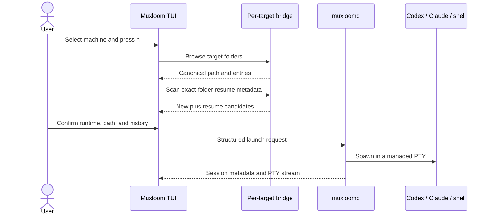
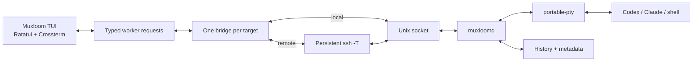

# Muxloom

<p align="center">
  A terminal-native workspace for persistent Codex, Claude Code, and shell sessions across local and SSH machines.
</p>

<p align="center">
  <a href="#english">English</a> ·
  <a href="#中文">中文</a> ·
  <a href="https://github.com/MarsTechHAN/Muxloom/releases">Releases</a> ·
  <a href="https://github.com/MarsTechHAN/Muxloom/actions/workflows/regression.yml">CI</a>
</p>

<p align="center">
  <a href="https://github.com/MarsTechHAN/Muxloom/actions/workflows/regression.yml"></a>
  <a href="https://github.com/MarsTechHAN/Muxloom/releases"></a>
  
  
  
</p>

> [!IMPORTANT]
> Muxloom manages terminal sessions; it does not replace Codex or Claude Code.
> Those CLIs run normally on the selected target. A detached `muxloomd`
> process owns each managed PTY, so closing the dashboard or losing SSH does
> not stop the agent.

---

<a id="english"></a>

## English

### Contents

- [Overview](#en-overview)
- [Install](#en-install)
- [First run](#en-first-run)
- [Interface](#en-interface)
- [Controls](#en-controls)
- [Configuration](#en-configuration)
- [Sessions, history, and attention](#en-sessions)
- [File manager and previews](#en-files)
- [Architecture](#en-architecture)
- [Troubleshooting](#en-troubleshooting)
- [Limitations and security](#en-limitations)

<a id="en-overview"></a>

### Overview

Muxloom is a Rust TUI for operating a working set of agent terminals spread
across folders and machines. It combines:

- SSH targets loaded from `~/.ssh/config`, plus the local machine;
- persistent Codex, Claude Code, and ordinary shell sessions;
- a machine pane, folder-grouped or flat session pane, and embedded terminal;
- resumable CLI histories, recaps, archive, attention alerts, and global search;
- local and remote file browsing, structured text previews, images, video,
  downloads, and drag-to-upload;
- responsive landscape, portrait, and compact layouts with persistent split
  positions.

Normal sessions are owned by `muxloomd` and do not appear in `tmux ls`. The
normal daemon data plane uses one multiplexed bridge per target. Control
messages, PTY traffic, history pages, file operations, and encoded media bytes
share that connection. Bootstrap and explicitly selected compatibility paths
may temporarily reuse a separate SSH ControlMaster or `scp`.

#### Platform support

| Platform | Controller | Local managed sessions | SSH targets |
| --- | --- | --- | --- |
| Linux x86_64 | Yes | Yes | Yes |
| macOS Apple Silicon | Yes | Yes | Yes |
| macOS Intel | Yes | Yes | Yes |
| Windows x86_64 | Yes | Not yet | Yes |

Release bundles include controller-side FFmpeg and companion binaries for
Linux x86_64, macOS Apple Silicon, and macOS Intel. A target normally needs
only a POSIX shell and SSH access for initial bootstrap; after installation,
managed PTY, history, search, probing, and file operations are implemented by
the Rust companion.

<a id="en-install"></a>

### Install

#### Release bundle

Download the archive for the controller from
[GitHub Releases](https://github.com/MarsTechHAN/Muxloom/releases). Keep the
extracted directory together: `muxloom` discovers the bundled `muxloomd`,
cross-platform companions, and FFmpeg relative to its own executable.

On macOS or Linux:

```bash
chmod +x muxloom muxloomd ffmpeg companions/*/muxloomd
./muxloom init
./muxloom
```

On Windows, run `muxloom.exe`; it can manage SSH targets. The current Windows
bundle does not provide a local `muxloomd`.

Each archive and standalone companion asset has a matching `.sha256` file.

#### Build from source

Requirements: Rust 1.85 or newer; `ssh` for remote targets; `curl` when the
controller must fetch a companion or agent package; and `ffmpeg` on `PATH` (or
`MUXLOOM_FFMPEG`) for video preview. Release bundles already include FFmpeg.

```bash
git clone https://github.com/MarsTechHAN/Muxloom.git
cd Muxloom
cargo build --release
./target/release/muxloom init
./target/release/muxloom
```

For a development run:

```bash
cargo run --bin muxloom
```

#### Command line

```text
muxloom [--config PATH] [--debug | --debug-log PATH]
muxloom init [--config PATH]
```

| Option | Purpose |
| --- | --- |
| `-h`, `--help` | Show command-line help |
| `-V`, `--version` | Show the Muxloom version |
| `--config PATH` | Use a custom TOML configuration |
| `--debug` | Write detailed logs to the default state directory |
| `--debug-log PATH` | Write detailed logs to an explicit file |

`muxloom init` refuses to overwrite an existing configuration.

<a id="en-first-run"></a>

### First run

1. Start `muxloom`. The local target is enabled by default; concrete aliases
   from the configured SSH config appear in Machines.
2. Select an SSH target and press `Space`, or click its checkbox, to enable it.
   Disabled targets are never probed.
3. Press `n` to start a session on the selected machine.
4. Choose Codex, Claude, or Terminal; choose a working directory; optionally
   add a label.
5. Choose `New session`, or resume a matching history discovered in that exact
   folder.
6. Press `Enter` or click the terminal to interact.
7. Move focus with the platform modifier plus an arrow, or click `Back`.
8. Press `q` to leave the dashboard. Managed sessions continue running.

If Codex or Claude is missing, the New flow asks before installing it. If the
target companion is missing or stale, the controller provisions the matching
binary automatically through the existing SSH connection.

#### Launch and resume flow



The path picker accepts typed text and ranks prefix matches first, then
substrings, then forward subsequences. `Left` returns to the parent, `Right`
enters a child, and `Enter` confirms the current folder. The Resume screen also
accepts `Left` to return to the launch form.

Resume candidates are read from the CLI's own metadata:

- Codex: `~/.codex/sessions` and `~/.codex/session_index.jsonl`;
- Claude Code: `~/.claude/projects`;
- Terminal: always starts a new shell.

The selected candidate expands to show its recap, or its first and last user
messages when no recap is available.

<a id="en-interface"></a>

### Interface

#### Landscape

```text
┌──── Machines ────┬──── Agents by folder ────┬──────── Live terminal ────────┐
│ target status    │ session, folder, recap    │ Codex, Claude, shell, or     │
│ runtime activity │ state and active marker   │ opened file preview          │
└──────────────────┴───────────────────────────┴───────────────────────────────┘
```

The focused sidebar expands for easier reading. Drag either divider to resize
it. Machine and agent widths are stored independently.

#### Portrait

```text
┌────────────────────────── Live terminal ───────────────────────────┐
│ terminal always occupies the upper, larger region                 │
├──────────────── Machines ─────────────┬──── Agents by folder ─────┤
│ lower-left                            │ lower-right                │
└───────────────────────────────────────┴────────────────────────────┘
```

Portrait detection prefers terminal pixel dimensions and falls back to cell
aspect ratio. Terminal height and the lower Machines/Agents split have their
own stored drag positions. Flat mode uses the full lower area for sessions.

When the terminal is too small for a readable multi-pane layout, Muxloom uses
a focus-based compact view. The terminal can fill the content area; the focus
shortcut or clickable Back control returns to navigation.

#### Session states

| State | Meaning |
| --- | --- |
| Working | The visible Codex or Claude terminal is heuristically classified as active work |
| Waiting | The visible screen requests user input or approval |
| Idle | The process is alive and waiting at its normal prompt |
| Archived | The agent exited or was stopped; metadata and history remain |

Working indicators animate in both Machines and folder/session rows. Codex uses
a cyan rotating braille spinner (`⠋⠙⠹…`); Claude uses its orange sparkle
(`✻✽✶✳`), matching the glyphs Claude Code itself cycles through. Both advance on
wall-clock time, so the animation speed stays constant regardless of redraw
rate. Terminal, Idle, Waiting, and Archived entries never animate.

<a id="en-controls"></a>

### Controls

The footer shows the most useful actions for the current context. Press `?`
for the complete categorized help inside the TUI.

#### Navigation and sessions

| Key | Action |
| --- | --- |
| macOS `Cmd+Arrow` or `Option+Arrow` | Move focus to the visible neighboring pane |
| Windows/Linux `Alt+Arrow` | Move focus to the visible neighboring pane |
| `Alt-1`, `Alt-2`, `Alt-3` | Focus Machines, Agents, or Terminal |
| `Up` / `Down`, `j` / `k` | Move the current selection |
| `Space` in Machines | Enable or disable a target |
| `n`, `Ctrl-n` | Start the New/Resume flow on the selected target |
| `Enter` | Open the selected terminal or confirm the current form |
| `x` | Archive a live agent; delete an already archived agent |
| `a` | Show or hide archived agents |
| `/`, `Ctrl-p` | Search all discovered session histories |
| `Ctrl-f` | Open or close Files in the current context |
| `,` | Edit configuration for the selected machine |
| `Ctrl-,` | Edit global configuration |
| `f` | Toggle grouped and flat session views |
| `v`, `Ctrl-h` | Hide disabled machines or show all |
| `r`, `Ctrl-r` | Refresh enabled targets |
| `?` | Open help |
| `q` | Exit without stopping managed sessions |

Focus shortcuts follow the rendered geometry: portrait navigation moves
between the upper terminal and lower panes instead of assuming a fixed
left-to-right layout. Unmodified arrows remain available to the application
when terminal input is active.

#### Terminal input and history

| Key or gesture | Action |
| --- | --- |
| Text, paste, and normal key chords | Forward to the focused PTY |
| `Shift+Enter`, `Option+Enter` | Insert a newline without submitting |
| `Ctrl-c`, `Ctrl-d` | Forward to the agent or shell |
| `PageUp`, `PageDown` | Move through terminal scrollback by a viewport |
| Mouse wheel over terminal | Move scrollback continuously in one-line steps |
| Drag over terminal text | Copy the selection on mouse release |
| `Alt` + drag | Forward mouse drag to a terminal application |

Back-scroll on an attached session reads the emulator's own rendered scrollback,
so live-redrawing TUIs (Codex, Claude Code) show real lines instead of a
linearized log. The daemon replays retained output on attach, so scrollback is
restored after quitting and relaunching the controller. Selecting and copying
works while scrolled back and while the file browser is open.

#### Mouse

Clicking a pane focuses it. Machine checkboxes, session rows, Archive, the Back
control, and the attention banner are clickable. Landscape and portrait
dividers can be dragged. Sidebar wheel events move by a visible page; terminal
wheel events scroll history. When the embedded program enables mouse reporting,
Muxloom forwards encoded mouse events unless the gesture is reserved for text
selection.

<a id="en-configuration"></a>

### Configuration

The default file is `~/.config/muxloom/config.toml`. A missing file is valid and
uses built-in defaults. UI state such as enabled machines, layout splits,
grouped/flat mode, and archive visibility is stored separately in
`~/.local/state/muxloom/state.json`.

```toml
refresh_interval_ms = 5000
ssh_connect_timeout_secs = 5
history_limit = 1000000
history_chunk_lines = 500
ssh_config = "~/.ssh/config"

attention_patterns = [
  "do you want to",
  "would you like to",
  "allow command",
  "approve",
  "waiting for your input",
  "press enter to confirm",
]

# Shell-style NAME=value assignments, injected into installs and launches.
# Legacy shell probes also receive them; daemon-native executable probes do not.
environment = ""
reverse_tunnel = ""

# Target command and optional controller-side companion asset.
companion_command = "muxloomd"
companion_binary = ""

[agents.codex]
command = "codex"
args = []
install = "curl -fsSL https://chatgpt.com/codex/install.sh | sh"
sync_files = ["~/.codex/config.toml", "~/.codex/auth.json"]

[agents.claude]
command = "claude"
args = []
install = "curl -fsSL https://claude.ai/install.sh | bash"
sync_files = ["~/.claude/settings.json"]

# Empty means the target user's SHELL, then /bin/sh.
[agents.terminal]
command = ""
args = []

# Overrides use an exact SSH Host alias or "local".
[hosts.gpu-box]
environment = 'HTTP_PROXY=http://127.0.0.1:18118 HTTPS_PROXY=http://127.0.0.1:18118'
reverse_tunnel = "18118:127.0.0.1:8118"
attention_patterns = ["gpu approval", "do you want to proceed"]

[hosts.gpu-box.codex]
command = "/opt/codex/bin/codex"
args = ["--full-auto"]

[hosts.gpu-box.claude]
command = "/opt/claude/bin/claude"
args = []

[hosts.gpu-box.terminal]
command = "/bin/zsh"
args = ["-l"]
```

`command` is one executable name or path. Arguments are structured values, not
a shell command string. Use a wrapper executable for pipes, redirects, or other
compound setup.

Environment values use shell-style assignments, for example:

```text
HTTP_PROXY=http://proxy:8118 HTTPS_PROXY=http://proxy:8118 TOKEN='two words'
```

Global values are merged with the selected machine's overrides and injected
into installs and launches by default. Legacy shell probes receive them, while
daemon-native executable probes do not. A reverse tunnel uses
`REMOTE_PORT:LOCAL_HOST:LOCAL_PORT`; the remote runtime can then point at
`127.0.0.1:REMOTE_PORT` while traffic exits through the controller's network.

Select a machine and press `,` to edit that machine's effective commands,
arguments, environment, tunnel, companion path, sync files, and attention
patterns. Press `Ctrl-,` for global defaults. Settings fields use shell-word
syntax rather than JSON.

#### Missing runtimes

When New detects that Codex or Claude is absent, Muxloom asks before making any
change. It prefers a compatible controller-side binary, otherwise downloads
and verifies a target-platform package on the controller, then transfers it to
the target. That staging path does not require target internet access. If
staging is not possible, Muxloom can run the configured user-level install
command with that machine's environment; the default installer then requires
direct or reverse-tunneled network access from the target.

Configured `sync_files` are copied from the controller user's home to the same
relative target paths. Existing target files receive timestamped backups;
missing source files are skipped. Session histories are never synchronized as
configuration.

<a id="en-sessions"></a>

### Sessions, history, and attention

#### Persistence

`muxloomd` directly owns the PTY and child process. The dashboard and SSH
bridge are subscribers, so either can disconnect without terminating the
session. Reconnection lists daemon metadata and resubscribes by session ID.

The daemon keeps append-only ANSI history on the target. The live parser only
maintains the visible screen; older pages are loaded in bounded chunks and
cached locally as needed. Useful chunks use LZ4 compression. Scroll offsets are
clamped to real history, preventing blank pages beyond the oldest output.

History rendering preserves basic, 256-color, and truecolor foreground and
background colors, plus bold, dim, italic, underline, reverse, and crossed-out
attributes.

#### Recap and search

Muxloom first looks for the last explicit `※ recap:` (or full-width-colon
variant). Otherwise it takes the last recognizable Codex/Claude assistant line
after excluding tool/status rows. As a final fallback it uses the last
non-interface text row. Control characters and whitespace are normalized, and
the result is bounded to 180 characters.

Search with `/` or `Ctrl-p`. Results cover live and archived local/remote
sessions and are ranked in this order:

1. label, display name, or folder path;
2. the current recap, then recap-marked history;
3. remaining daemon history.

#### Archive

Codex and Claude sessions enter Archived after they exit or after the first
`x`. Their metadata, recap, and history remain searchable. Opening an Archived
agent attempts to resume the newest matching CLI history for its machine,
runtime, and folder. Pressing `x` again permanently removes its daemon metadata
and stored history.

Ordinary Terminal sessions do not enter Archived; shell exit or `x` removes
them directly.

#### Attention and activity

Attention detection inspects only the bottom physical rows of the current
screen. Attached and legacy-inspected sessions combine known Codex/Claude
approval layouts with per-machine patterns; background daemon snapshots use
the built-in layouts. A normal idle prompt alone is not considered a request.

When input is newly required, Muxloom shows a clickable banner, marks the
session Waiting, rings the terminal bell, and emits OSC 9 for terminals that
surface desktop notifications. Repeated scans of the same prompt are
deduplicated.

The attached terminal updates Working/Waiting state directly from live frames,
so short inference runs are not lost between background refreshes. Daemon
snapshots keep non-selected sessions current.

<a id="en-files"></a>

### File manager and previews

Press `Ctrl-f` to open Files at the selected agent's folder, or at `.` on the
selected machine when no session is selected.

- From the live terminal pane, Files opens as a left sidebar and the terminal
  remains on the right. Opening a file replaces the right pane with Preview;
  opening it again restores the terminal.
- From Agents by folder, that pane becomes the file selector. Opening a file
  renders Preview in the large terminal pane.

While the file pane holds focus it owns keyboard input, so unbound text such as
`n` cannot leak into global session actions. Move focus to another pane (the
pane-focus shortcut, or clicking it) to type or control there; Files stays open
in its own pane. Entering or leaving a directory clears the match query.

| Key or gesture | Action |
| --- | --- |
| `Up` / `Down`, `j` / `k` | Select an entry |
| Type text | Match entries in the current directory |
| `Right`, `Enter`, double-click | Enter a directory or toggle file Preview |
| `Left`, right-click | Go to the parent directory |
| Arrows, `PageUp` / `PageDown` | Page an opened file; forward past the end wraps |
| `g` / `G`, `Home` / `End` | Jump to preview start or end |
| `c` | Copy the selected target-side full path |
| Drag over preview text | Copy the selected preview text on mouse release |
| `d` | Download the selected file to `~/Downloads` |
| Drag local files into the terminal | Upload them to the browsed directory |
| `r`, `F5` | Refresh the current directory |
| Drag the Files divider | Resize and store the file pane width |
| `Esc` | Close Preview, then clear a query, then close Files |
| `Ctrl-f` | Close Files from any file-browser state |

Directory listing, content detection, bounded reads, and metadata extraction
run on the target. Missing optional target utilities do not produce placeholder
errors. Navigation remains active while requests are loading; stale results are
discarded, and neighboring directories/files are preloaded.

#### Preview formats

| Content | Rendering |
| --- | --- |
| Source and text | Content-based detection and bundled `syntect` highlighting |
| Markdown | Headings `#` through `####`, bold, lists, quotes, fenced code, tables, and rules |
| JSON | Parsed and pretty-printed |
| JSONL | Parsed record by record |
| CSV / TSV | Structured table |
| Images | Controller-side Rust decoding, truecolor half-block rendering |
| Video | Encoded bytes streamed to controller-side FFmpeg, paced frame rendering |
| Audio | Metadata only; playback is not implemented |

Text previews are bounded to 256 KiB. Previewing does not create a local copy.
Downloads show transferred bytes, percentage, and live throughput. Media stays
encoded across SSH; the target never sends expanded RGB frames and does not
need FFmpeg.

<a id="en-architecture"></a>

### Architecture



#### Transport

The normal daemon data plane for each remote target uses one long-lived,
non-PTY SSH process. A framed protocol multiplexes request IDs and stream IDs
over it. Requests can complete out of order; stream credit provides
backpressure; heartbeats detect a dead bridge; large payloads use LZ4 only when
compression is useful. Keyboard and control frames remain small and immediate.

Companion bootstrap compares SHA-256 fingerprints calculated by the Rust
binaries. A missing or stale binary is sent atomically through the same SSH
stdin. If daemon provisioning or launch fails and tmux exists, Muxloom can use
an explicitly labelled compatibility fallback; the TUI requires the user to
acknowledge it. Bootstrap, runtime staging, and legacy operations may reuse an
additional SSH ControlMaster or `scp` channel outside the normal data plane.

Daemon replacement is non-disruptive. A newly installed binary cannot replace
a daemon that owns live PTYs or serves another controller. The old generation
continues over the compatible protocol until idle, then drains, exits, and lets
the next bridge start the new generation. Session history and metadata remain
in the state directory throughout handover.

#### Terminal rendering

`muxloomd` broadcasts PTY bytes. `vt100::Parser` maintains alternate-screen
state, cursor, colors, styles, mouse mode, application cursor keys, and
bracketed paste. Ratatui renders only inside the assigned pane. Switching
sessions keeps the old frame visible while a pending PTY loads, then swaps after
the new stream produces its first visible frame.

#### Source map

| Module | Responsibility |
| --- | --- |
| `src/main.rs` | CLI, terminal guards, signals, event loop, notifications |
| `src/app.rs` | State machine, focus, forms, retries, input routing |
| `src/ui.rs` | Responsive layouts, widgets, VT cells, preview rendering |
| `src/worker.rs` | Background typed request/event execution |
| `src/runtime.rs` | Launch, discovery, installation, compatibility backend |
| `src/bridge.rs` | Persistent connections, bootstrap, multiplexed streams |
| `src/daemon_protocol.rs` | Frames, compression, request/stream types |
| `src/daemon.rs` | PTY supervisor, history, archive, files, search |
| `src/bin/muxloomd.rs` | Companion `serve`, `bridge`, and `status` commands |
| `src/terminal_session.rs` | Live parser, input encoding, resize safety |
| `src/media.rs` | Image/video decode and playback updates |

<a id="en-troubleshooting"></a>

### Troubleshooting

Start with an explicit log:

```bash
muxloom --debug-log /tmp/muxloom-debug.log
```

Useful entries include:

| Log text | Meaning |
| --- | --- |
| `layout cells=... pixels=... portrait=... compact=...` | Actual responsive-layout decision |
| `probe done ... backend=muxloomd` | Target and daemon session scan succeeded |
| `source=live-terminal ... working=...` | Attached frame changed agent activity |
| `source=muxloomd ... working=...` | Daemon snapshot for a discovered session |
| `terminal first frame ready` | Pending terminal became visible |
| `bridge reached EOF` | Transport closed; daemon-owned agents may still be running |

Common checks:

- **Target stays offline:** run `ssh -T -o BatchMode=yes <alias> true`, then
  inspect the bridge bootstrap error in the log.
- **Remote renders but does not accept input:** confirm `connected ... via one
  persistent bridge`, `terminal first frame ready`, and the absence of a later
  EOF.
- **Working animation is missing:** look for both `source=live-terminal` and
  `source=muxloomd` activity records and verify the target companion fingerprint
  was updated.
- **Codex cannot find `bubblewrap`/`bwrap`:** use the standalone Codex package
  or configure an absolute executable/wrapper that includes its resources.
- **Portrait still renders horizontally:** inspect the `layout` pixel/cell
  dimensions; some outer terminals do not report pixel size.
- **Attention is too broad:** inspect the matched reason and visible tail, then
  narrow that machine's `attention_patterns`.
- **Video cannot decode:** verify the release-bundled `ffmpeg`,
  `MUXLOOM_FFMPEG`, or an `ffmpeg` on the controller `PATH`.

> [!WARNING]
> Debug logs can contain small excerpts from the visible agent screen. Treat
> them as potentially sensitive.

<a id="en-limitations"></a>

### Limitations and security

- Direct Codex-to-Claude history conversion is not implemented. Their private
  event formats are independent and change over time.
- Windows currently controls remote targets but does not host local managed
  sessions.
- Audio playback and interactive video seek/volume controls are not implemented.
- Resume discovery depends on the current local metadata formats of Codex and
  Claude Code.
- Attention detection is heuristic; machine-specific patterns should be narrow.
- Enabling a target authorizes periodic BatchMode SSH access and companion
  management for that alias.
- Target-side history can contain sensitive conversations and command output.
- Search queries are sent to every enabled target included in the search.
- Muxloom does not add permission-bypass arguments by default. Any configured
  runtime flags retain the security consequences of that runtime.

---

<a id="中文"></a>

## 中文

### 目录

- [项目概览](#zh-overview)
- [安装](#zh-install)
- [首次使用](#zh-first-run)
- [界面与布局](#zh-interface)
- [操作](#zh-controls)
- [配置](#zh-configuration)
- [会话、历史与提醒](#zh-sessions)
- [文件管理与预览](#zh-files)
- [实现架构](#zh-architecture)
- [排障](#zh-troubleshooting)
- [限制与安全](#zh-limitations)

<a id="zh-overview"></a>

### 项目概览

Muxloom 是一个用 Rust 实现的终端工作台，用于从一个 TUI 管理分布在多台机器、多个
目录中的 Codex、Claude Code 和普通 Shell 会话。它提供：

- 从 `~/.ssh/config` 加载 SSH 目标，并同时管理本机；
- 按机器、目录分组或 Flat 模式浏览会话；
- 在 Dashboard 内完整渲染并交互真实 PTY；
- Resume、Recap、Archive、交互提醒和跨会话全文搜索；
- 本地/远程文件浏览、结构化文本、图片和视频预览、下载与拖拽上传；
- 横屏、竖屏和小尺寸 Compact 布局，以及独立持久化的分割位置。

正常会话由目标机器上的 `muxloomd` 持有，不会出现在 `tmux ls`。退出 Dashboard、
SSH 断开或 Controller 休眠都不会结束 Agent。正常 daemon 数据面为每台远端机器维护
一条持久 SSH Bridge，Control、PTY、History、Files 和编码媒体数据都复用这条连接。
Bootstrap 和明确选择的兼容路径可能临时复用单独的 SSH ControlMaster 或 `scp`。

平台支持：Linux x86_64、Apple Silicon macOS 和 Intel macOS 可以运行 Controller 与
本地会话；Windows x86_64 可以作为 SSH Controller，暂不支持 Windows 本地 daemon。

<a id="zh-install"></a>

### 安装

从 [GitHub Releases](https://github.com/MarsTechHAN/Muxloom/releases) 下载对应控制机的
压缩包。请保留解压后的目录结构，`muxloom` 会相对自身查找 `muxloomd`、其他目标架构
的 companion 和 FFmpeg。

macOS/Linux：

```bash
chmod +x muxloom muxloomd ffmpeg companions/*/muxloomd
./muxloom init
./muxloom
```

Windows 运行 `muxloom.exe` 管理 SSH 目标。每个压缩包和独立 companion 都带有
`.sha256` 文件。

源码构建需要 Rust 1.85 或更高版本；远程目标需要 `ssh`；Controller 补取 companion 或
Agent Package 时需要 `curl`；视频预览需要 `PATH` 中的 `ffmpeg` 或
`MUXLOOM_FFMPEG`。Release Bundle 已经包含 FFmpeg。

```bash
git clone https://github.com/MarsTechHAN/Muxloom.git
cd Muxloom
cargo build --release
./target/release/muxloom init
./target/release/muxloom
```

开发运行使用 `cargo run --bin muxloom`。

命令行：

```text
muxloom [--config PATH] [--debug | --debug-log PATH]
muxloom init [--config PATH]
```

`--config` 指定 TOML；`--debug` 写入默认 Debug Log；`--debug-log PATH` 指定日志路径。
`muxloom init` 不会覆盖已有配置。

<a id="zh-first-run"></a>

### 首次使用

1. 启动 `muxloom`。本机默认启用，具体 SSH Alias 会显示在 Machines。
2. 选择远端机器，按 `Space` 或点击 Checkbox 启用；未启用的机器不会探测。
3. 按 `n`，启动目标就是当前选中的机器。
4. 选择 Codex、Claude 或 Terminal，选择工作目录，并可填写 Label。
5. 直接选择 `New session`，或从当前 Runtime、当前精确目录的历史中 Resume。
6. 按 `Enter` 或点击 Terminal 开始输入。
7. 使用平台组合键加方向键，或点击 Back 返回导航。
8. 按 `q` 退出 Dashboard；daemon 管理的会话继续运行。

路径选择器支持直接输入文本，排序依次为前缀、子串、前向子序列匹配。`Left` 返回父目录，
`Right` 进入子目录，`Enter` 确认当前目录。Resume 页面也支持 `Left` 返回启动表单。

Codex Resume 来源是 `~/.codex/sessions` 和 `~/.codex/session_index.jsonl`；Claude
来源是 `~/.claude/projects`。候选项优先显示 Recap，没有 Recap 时显示第一条和最后一条
用户消息。Terminal 始终新建。

<a id="zh-interface"></a>

### 界面与布局

横屏：

```text
┌──── Machines ────┬──── Agents by folder ────┬──────── Live terminal ────────┐
│ 机器与 Runtime   │ 会话、目录、Recap、状态  │ Codex、Claude、Shell 或预览  │
└──────────────────┴───────────────────────────┴───────────────────────────────┘
```

竖屏：

```text
┌────────────────────────── Live terminal ───────────────────────────┐
│ Terminal 始终位于上方并占大部分空间                               │
├──────────────── Machines ─────────────┬──── Agents by folder ─────┤
│ 左下                                  │ 右下                       │
└───────────────────────────────────────┴────────────────────────────┘
```

选中的侧栏会自动变宽。横屏的 Machine/Agent 宽度、竖屏的 Terminal 高度和下方分割点
分别记录。终端尺寸过小时使用按 Focus 展示的 Compact 模式；Terminal 可以占满内容区域，
通过组合键或 Back 返回。

会话状态：

| 状态 | 含义 |
| --- | --- |
| Working | 当前可见 Codex/Claude 终端被启发式识别为正在推理或执行工具 |
| Waiting | 当前可见屏幕正在等待确认或输入 |
| Idle | 进程存活并停在普通输入提示 |
| Archived | Agent 已退出或被停止，元数据和历史仍保留 |

Working 动画同时出现在 Machines 和 Folder/Agent 行：Codex 使用青色旋转盲文 spinner
（`⠋⠙⠹…`），Claude 使用橙色 sparkle（`✻✽✶✳`），与 Claude Code 自身循环的字形一致。
两者均按墙钟时间推进，速度不随重绘频率变化。Terminal、Idle、Waiting、Archived
不播放动画。

<a id="zh-controls"></a>

### 操作

底部 Footer 会根据当前上下文展示常用操作；按 `?` 打开完整分类 Help。

| 按键 | 行为 |
| --- | --- |
| macOS `Cmd+Arrow` / `Option+Arrow` | 按实际布局移动 Focus |
| Windows/Linux `Alt+Arrow` | 按实际布局移动 Focus |
| `Alt-1` / `Alt-2` / `Alt-3` | 跳到 Machines / Agents / Terminal |
| `Space`（Machines） | 启用或禁用机器 |
| `n` / `Ctrl-n` | 在当前机器进入 New/Resume 流程 |
| `Enter` | 打开 Terminal 或确认表单 |
| `x` | Live Agent 归档；Archived Agent 永久删除 |
| `a` | 展开或收起 Archived |
| `/` / `Ctrl-p` | 搜索全部会话历史 |
| `Ctrl-f` | 按当前上下文展开或关闭 Files |
| `,` / `Ctrl-,` | 编辑当前机器配置 / 全局配置 |
| `f` | 切换 Grouped / Flat |
| `v` / `Ctrl-h` | 隐藏未启用机器 / 显示全部 |
| `r` / `Ctrl-r` | 立即刷新 |
| `q` | 退出 Dashboard，不停止 Agent |

Terminal 输入激活后，普通方向键、文字、粘贴和组合键直接进入 PTY；未加 Modifier 的方向键
不会切换 Pane。`Shift+Enter` 或 `Option+Enter` 插入换行，`Ctrl-c`/`Ctrl-d` 原样转发。
`PageUp`/`PageDown` 按页浏览历史，滚轮每次移动一行。已连接会话的回滚读取仿真器自身渲染的
scrollback，因此 Codex、Claude Code 等实时重绘 TUI 显示真实行而非线性化日志；daemon 在
attach 时回放保留的输出，退出并重新启动 controller 后 scrollback 仍会恢复。回滚时以及打开
文件浏览器时都可以选择并复制内容。

鼠标支持点击 Focus/选择、Checkbox、Archive、Back 和提醒 Banner。可以拖动所有布局分隔线；
直接拖选 Terminal 文本会在松开时复制，`Alt+拖拽` 则转发给启用 Mouse Reporting 的程序。

<a id="zh-configuration"></a>

### 配置

默认配置是 `~/.config/muxloom/config.toml`；文件不存在时使用内置默认值。启用机器、
布局分割点、Grouped/Flat 和 Archive 可见性单独保存在
`~/.local/state/muxloom/state.json`。

完整 TOML 示例见英文部分的[配置](#en-configuration)。主要配置包括：

- `refresh_interval_ms`、SSH Timeout、History 大小和分段行数；
- SSH Config 路径、全局 Attention Patterns；
- Codex、Claude、Terminal 的 `command`、`args`、安装命令与 `sync_files`；
- 全局和每台机器独立的 `NAME=value` 环境变量；
- 每台机器独立的 `REMOTE_PORT:LOCAL_HOST:LOCAL_PORT` Reverse Tunnel；
- companion 命令和可选 Controller 本地 binary 路径；
- `[hosts.<alias>]` 下对某台机器的 Runtime 覆盖。

`command` 是单个可执行文件名或路径，参数作为结构化数组传输。Pipe、Redirect 或复杂初始化
应写入 Wrapper。环境变量使用下面的非 JSON 格式，并默认注入 Install 和 Launch；legacy
Shell Probe 也会注入，但 daemon-native executable probe 不会：

```text
HTTP_PROXY=http://proxy:8118 HTTPS_PROXY=http://proxy:8118 TOKEN='two words'
```

选择机器按 `,` 编辑该机器的有效配置；按 `Ctrl-,` 编辑全局默认值。Args、Sync Files 和
Attention Patterns 使用 Shell Word 语法。

当 New 发现 Codex/Claude 不存在时，Muxloom 会先询问。它优先复用 Controller 上兼容的
binary，否则由 Controller 下载并校验目标平台产物，再传到目标；这条 staging 路径不要求
目标机器访问外网。Controller 无法准备时才执行该机器配置的用户态安装命令，此时默认
Installer 需要目标直连或通过 Reverse Tunnel 访问网络。`sync_files` 会复制到目标用户 Home
下相同的相对路径，已有文件先备份，历史目录不会作为配置同步。

<a id="zh-sessions"></a>

### 会话、历史与提醒

`muxloomd` 直接持有 PTY 和子进程，Dashboard 与 SSH Bridge 只是订阅者。重连后按 Session
ID 恢复订阅。daemon 在目标端追加保存 ANSI History；旧页面按需分段读取并缓存在本机，
有效大块使用 LZ4。Offset 会限制在真实历史内，不会滚到不存在的空白区域。

历史渲染保留基础色、256 色、Truecolor 前景/背景以及 Bold、Dim、Italic、Underline、
Reverse 和 Crossed-out 属性。

Recap 先取最后一个 `※ recap:`（也支持全角冒号）；否则取最后一条能识别的 Codex/Claude
Assistant 行并排除工具/状态行；仍无法识别时，回退到最后一条非界面文本。结果会归一化
控制字符和空白，并限制在 180 字符。按 `/` 或 `Ctrl-p` 搜索 Live/Archived、本地/远端
全部会话，排序优先级是 Label/名称/路径、当前 Recap 与 Recap History、其他 History。

Codex/Claude 退出或第一次按 `x` 后进入 Archived，仍可查看和搜索。打开 Archived 会按
原机器、Runtime 和目录尝试 Resume 最新历史；再次按 `x` 才永久删除 daemon 元数据与历史。
普通 Terminal 不归档，Shell 退出或按 `x` 后直接清理。

提醒只检查当前屏幕底部物理行。Attached 和 legacy-inspected Session 会组合内置审批布局与
每机器 Pattern；后台 daemon snapshot 当前只使用内置布局。新提醒会显示可点击 Banner、
Waiting 状态、Bell 和 OSC 9，并对同一个 Prompt 去重。Attached Terminal 直接从实时帧
更新 Working/Waiting，因此短推理不会被后台刷新间隔漏掉；其他会话由 daemon snapshot 更新。

<a id="zh-files"></a>

### 文件管理与预览

按 `Ctrl-f` 从当前 Agent 目录打开 Files；没有选中会话时从当前机器的 `.` 开始。

- Focus 在 Live Terminal 时，Files 作为左侧 Sidebar，右侧保留 Terminal；打开文件后右侧
  变为 Preview，再打开一次恢复 Terminal。
- Focus 在 Agents by folder 时，该 Pane 变成文件选择器；打开文件后在上方/右侧的大
  Terminal Pane 中显示 Preview。

Focus 在文件 Pane 时它会捕捉文本和组合键，`n` 等不会泄漏成全局操作。把 Focus 切到其他
Pane（Pane-focus 快捷键或点击）即可在那里输入或操作，Files 仍停留在自己的 Pane。进入或
离开目录会清空 Match Query。

| 按键或操作 | 行为 |
| --- | --- |
| `Up` / `Down`、`j` / `k` | 选择文件或目录 |
| 直接输入 | 在当前目录 Match |
| `Right`、`Enter`、双击 | 进入目录或展开/收起 Preview |
| `Left`、右键 | 返回父目录 |
| 方向键、`PageUp` / `PageDown` | 对打开内容翻页，末尾继续向后会折回 |
| `g` / `G`、`Home` / `End` | 跳到 Preview 开头或末尾 |
| `c` | 复制目标机器上的完整路径 |
| 在 Preview 上拖拽 | 松开鼠标时复制选中的 Preview 文本 |
| `d` | 下载到 Controller 的 `~/Downloads` |
| 拖入本地文件 | 上传到当前浏览目录 |
| `r` / `F5` | 刷新目录 |
| 拖动 Files 分隔线 | 调整并保存文件 Pane 宽度 |
| `Esc` | 依次关闭 Preview、清空 Query、关闭 Files |
| `Ctrl-f` | 从任意文件状态直接关闭 Files |

目录枚举、内容识别、限量读取和元数据提取都在目标执行。Loading 不阻塞返回父目录或进入已缓存
目录；过期请求结果会丢弃，并预加载相邻目录和文件。

源码和普通文本按内容识别并使用 `syntect` 高亮；Markdown 支持 `#` 到 `####`、Bold、列表、
引用、代码块、Table 和 `---`；JSON、JSONL、CSV、TSV 会结构化解析。文本最多读取 256 KiB。
图片在 Controller 用 Rust 解码并以 Truecolor 半块显示；视频保持编码形式跨 Bridge，在
Controller 用 FFmpeg 解码和按时间渲染。目标不需要 FFmpeg，也不会传膨胀的 RGB。Audio
目前只显示元数据，不播放。

打开 Preview 不会产生本地副本。只有下载才落盘，并显示字节数、百分比和实时速度。

<a id="zh-architecture"></a>

### 实现架构

参见英文部分的[架构图](#en-architecture)。主线程负责 Crossterm Event、`App` 状态和
Ratatui 绘制；文件、搜索、Probe 和 Runtime 操作通过强类型 Request/Event 在 Worker 执行。

每个远端目标的正常 daemon 数据面使用一条不分配 PTY 的 SSH 长连接。Versioned Frame
使用 Request ID 和 Stream ID 复用并发操作，Credit Window 提供背压，Heartbeat 检测
断线，大数据只在值得时使用 LZ4。daemon Bridge 的 Reverse Tunnel 作为同一 SSH 进程的
`-R` 参数；legacy 和 staging 兼容路径仍可能使用 ControlMaster 或 `scp`。

Bootstrap 由 Rust binary 自己计算 SHA-256 Fingerprint。缺失或过期 companion 通过同一
SSH stdin 原子安装。如果 daemon provisioning 或 launch 失败且目标有 tmux，可以进入明确
标记且必须确认的兼容回退。

daemon 升级不会打断活动 PTY：新 binary 先安装；旧 daemon 只要仍有 Live Session 或其他
Controller，就继续用兼容协议运行。空闲后才 Drain、自行退出并由下一条 Bridge 启动新
Generation。History 和 Metadata 始终保留在状态目录。

Terminal 字节由 `vt100::Parser` 维护 Alternate Screen、光标、颜色、样式、Mouse Mode、
Application Cursor 和 Bracketed Paste，并由 Ratatui 限制在对应 Pane 内。切换 Agent 时保留
旧画面，后台等待新 PTY 首帧后再原子替换，避免闪白。

主要模块职责见英文部分的 [Source map](#en-architecture)。

<a id="zh-troubleshooting"></a>

### 排障

```bash
muxloom --debug-log /tmp/muxloom-debug.log
```

重点日志：

- `layout ... portrait=... compact=...`：实际布局判断；
- `probe done ... backend=muxloomd`：目标和 daemon Session 扫描成功；
- `source=live-terminal ... working=...`：Attached 实时帧改变状态；
- `source=muxloomd ... working=...`：daemon 返回的其他会话状态；
- `terminal first frame ready`：新 Terminal 首帧已切换；
- `bridge reached EOF`：连接关闭，但 daemon Agent 可能仍在运行。

常见检查：

- Machine Offline：先执行 `ssh -T -o BatchMode=yes <alias> true`，再看 Bootstrap 错误；
- Remote 能显示不能输入：确认 persistent bridge、first frame ready，且随后没有 EOF；
- Working 动画不出现：检查 `source=live-terminal` / `source=muxloomd` 和 companion Fingerprint；
- Codex 缺 `bubblewrap`/`bwrap`：使用带资源的 Standalone Package 或绝对 Wrapper；
- 竖屏仍横向：查看 Layout Log 的 Pixel/Cell，外层终端可能没有报告 Pixel Size；
- 提醒误报：根据 Reason 和可见 Tail 收窄该机器的 `attention_patterns`；
- 视频不能解码：检查 Bundle 内 FFmpeg、`MUXLOOM_FFMPEG` 或 Controller `PATH`。

Debug Log 可能包含少量当前 Agent 可见文本，应按敏感信息处理。

<a id="zh-limitations"></a>

### 限制与安全

- 暂未实现 Codex 与 Claude 之间的历史转换；
- Windows 暂时只能作为远程 Controller；
- Audio Playback、Video Seek 和音量控制暂未实现；
- Resume 依赖 Codex/Claude 当前的本地元数据格式；
- Attention 是启发式检测，每台机器的 Pattern 应尽量具体；
- 启用机器意味着允许周期性 BatchMode SSH 和 companion 管理；
- 目标 History、Debug Snippet 和搜索结果都可能包含敏感内容；
- Muxloom 默认不添加跳过 Agent 权限检查的参数，用户配置的 Runtime Args 仍具有对应风险。

---

## License

Muxloom is distributed under the
[GNU General Public License v3.0 only](./LICENSE).
