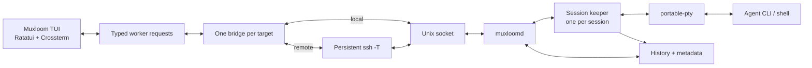

<div align="center">

# Muxloom

**A terminal-native workspace for persistent Codex, Claude Code, OpenCode, Pi, and shell sessions across local and SSH machines.**

[English](./README.md) · [中文](./README.zh-CN.md) · [Releases](https://github.com/MarsTechHAN/Muxloom/releases) · [CI](https://github.com/MarsTechHAN/Muxloom/actions/workflows/regression.yml)

[](https://github.com/MarsTechHAN/Muxloom/actions/workflows/regression.yml)
[](https://github.com/MarsTechHAN/Muxloom/releases)


</div>

**Homebrew (macOS)** — tap once, then take either line:

```bash
brew tap marstechhan/muxloom https://github.com/MarsTechHAN/Muxloom

brew install --cask muxloom                               # stable: tagged releases
brew install --HEAD marstechhan/muxloom/muxloom-nightly   # nightly: newest green commit on main
```

> [!IMPORTANT]
> Muxloom manages terminal sessions; it does not replace the agent CLIs.
> Those CLIs run normally on the selected target. A detached `muxloomd` process
> owns each managed PTY, so closing the dashboard or losing SSH never stops the
> agent.

## Contents

- [Why Muxloom](#why-muxloom)
- [Features](#features)
- [Feature tour](#feature-tour)
- [Install](#install)
- [Quick start](#quick-start)
- [Controls](#controls)
- [Configuration](#configuration)
- [MCP](#mcp)
- [Agent collaboration](#agent-collaboration)
- [How it works](#how-it-works)
- [Platform support](#platform-support)
- [Troubleshooting](#troubleshooting)
- [Limitations and security](#limitations-and-security)
- [Contributing](#contributing)
- [License](#license)

## Why Muxloom

Running several coding agents across folders and machines usually means a wall
of SSH tabs and `tmux` windows, and a dropped connection can take a running
agent with it. Muxloom is a single Rust TUI that keeps that working set in one
place: a machine pane, a folder-grouped session pane, and an embedded terminal,
all backed by a daemon that owns the real PTYs.

It brings together:

- SSH targets from `~/.ssh/config` plus the local machine;
- persistent **Codex**, **Claude Code**, **OpenCode**, **Pi**, and ordinary
  **shell** sessions, offered per machine according to what is installed there;
- resumable histories, recaps, archive, global search, and attention alerts;
- a remote file browser with syntax-highlighted text, image, and video previews;
- responsive landscape, portrait, and compact layouts with persistent splits.

Managed sessions are owned by `muxloomd` and do not appear in `tmux ls`. Each
target is reached over a single multiplexed bridge that carries control
messages, PTY traffic, history pages, file operations, and encoded media.

## Features

- 🗄️ **Multi-machine** — one dashboard for local and SSH targets; enable a host
  and Muxloom probes and provisions it over the existing connection.
- 🔌 **Survives disconnects and upgrades** — a per-session keeper process owns
  the PTY, so quitting the dashboard, losing SSH, replacing `muxloomd`, or
  even a daemon crash leaves the agent running.
- 🚀 **Start & resume** — a New/Resume flow with a fuzzy path picker that reads
  Codex and Claude Code session metadata to resume the right history.
- 📁 **Remote file browser** — browse, filter, preview, download, and
  drag-to-upload, with syntax highlighting, Markdown, JSON/JSONL/CSV, images,
  and video decoded on the controller.
- ⌨️ **Real terminal** — a `vt100` emulator with true scrollback, text
  selection, mouse reporting, and bracketed paste.
- 🔍 **Search, recap & archive** — ranked full-text search across live and
  archived sessions, per-session recaps, and a searchable archive.
- 🔔 **Attention alerts** — approval and input prompts raise a clickable banner,
  the bell, and desktop notifications.
- 🧭 **Responsive layout** — landscape, portrait, and compact modes that follow
  the rendered geometry, with independently persisted split ratios.
- 🤖 **MCP** — `muxloom mcp` and `muxloomd mcp` serve the whole workspace to AI
  agents over the Model Context Protocol: session status, launch/resume,
  typed input, screen reads, search, and files.
- 💬 **Agents that work together** — a talk board every machine replicates,
  direct messages between agent sessions across hosts, waits and standing
  triggers, and cross-machine transcript search; press `b` to watch it all.

## Feature tour

### 🗄️ Machines and targets

The Machines pane lists the local host and concrete aliases from your SSH
config. Enabling a target authorizes periodic BatchMode probing; disabled
targets are never touched.

**Keys** — `Space` enable/disable · `Ctrl-r` refresh · `v` hide disabled hosts ·
single-click select · double-click directly on `[x]` enable/disable. Each
machine remembers its last selected agent while you move between targets.

### 🚀 Start and resume agents

`n` opens the New/Resume flow. Pick a runtime and a working directory with the
fuzzy path picker, then start fresh or resume a history discovered in that exact
folder. The runtime row lists what the selected machine actually has — a
machine without OpenCode never offers it — and falls back to the full list for
a machine Muxloom has not reached yet, so the install prompt stays reachable.
The form opens on the runtime you last launched on that machine, alongside the
folder it remembers, and drops back to the first one on offer if that runtime
is gone.
Every scan includes both Codex (`~/.codex/sessions`) and Claude Code
(`~/.claude/projects`) histories, marks each candidate with its runtime icon,
and expands to show a recap. A matching runtime resumes natively. Selecting the
other runtime shows a type-mismatch confirmation and can start a fresh agent
with the source history file referenced in its initial prompt. OpenCode and Pi
keep no transcript Muxloom can read, so they start fresh and are backed up from
their terminal capture alone.

**Keys** — `n` open · type to fuzzy-match a folder · `Left`/`Right` navigate ·
`Enter` confirm.

From the Agents pane, `t` opens the same runtime chooser for a **Temporal Chat**.
It gets a scratch folder of its own — `<muxloomd state>/scratch/<session id>`,
made when it launches and removed with it — rather than moving into whichever
project happened to be selected, so a throwaway agent leaves nothing behind in a
repository. Type a name in the same form to tell several of them apart; left
blank they are all called Temporal Chat. Temporal Chat stores no Muxloom ANSI
history and is excluded from search and backup; Codex also runs with transcript
persistence disabled. `x` destroys it instead of archiving it. They
sit at the very top of the session list, above every folder, because a scratch
chat you opened seconds ago is the one you are looking for.

Press `p` in Agents by folder to forward a service on the selected machine to
controller loopback. Set the remote host/port and local port (`0` allocates one),
then use `127.0.0.1:LOCAL_PORT`. Linux companions detect non-privileged listening
ports natively; every platform also extracts loopback URLs visible in the agent
terminal. Manual entry remains available when detection is unavailable. TCP
traffic is multiplexed through the target's persistent bridge, and `d` stops a
highlighted forward without touching the remote process. Local listeners live
only for the current Muxloom controller process.

### 🧭 Responsive layout

Panes follow the rendered geometry: landscape places navigation beside the
terminal, portrait stacks the terminal above the sidebars, and a compact mode
focuses a single pane on small screens. Focus moves with the platform modifier
plus an arrow, and the session pane toggles between folder groups and a flat
list. In the grouped view each folder heading is drawn as a shaded band across
the full width, so where one folder ends and the next begins is visible without
counting indentation.

**Keys** — `Alt`+arrow (macOS `Cmd`/`Option`+arrow) move focus · `Alt-1/2/3`
jump to a pane · `f` grouped/flat · drag any divider to resize.

### ✦ Working status and attention

Agent sessions animate **only** while classified as working — cyan braille dots
for Codex, an orange sparkle for Claude, a violet lozenge for OpenCode, a
rotating π for Pi, all on a constant wall-clock cadence — and only on the agent
row itself. Folder group rows carry their children's state as a steady colour
(yellow when one waits for input, green when one works) and machine rows show a
static capability icon for each runtime that machine has, so exactly one thing
on screen blinks per busy agent. When the list is scrolled far enough that a
folder row has gone off the top, the agent left at the top of the pane keeps
its folder on the pane's own edge, in that same colour. Working means the CLI's interrupt marker or a
live status line — a turning spinner over a counter, which is all a phase that
offers no interrupt leaves behind, compaction included — is on screen *and* the
daemon has heard the session speak. How long such a screen outlives the last
byte off the PTY depends on which marker it is: seconds for a spinner, which
stops turning the moment the CLI stops painting, but minutes for an interrupt
hint held on a status bar, because a turn that shells out to a build holds one
the whole time it says nothing at all. A session a new daemon adopted has its
screen replayed out of the capture, which may be drawing a turn that ended an
hour ago, so it counts as working only once this daemon has heard it — a
rebuild no longer lights up every untouched agent on the machine at once. Codex
activity additionally follows its OSC title spinner, so status survives the
CLI erasing and repainting the visible `Working` line. When a session needs
input — approval prompts, numbered menus, or your own `attention_patterns`,
which the daemon now applies itself at its own refresh cadence — its entire
agent item turns bold yellow, it raises a clickable banner, rings the bell,
and emits a desktop notification. The reason it reports is the question being
asked, in the words it is asked in, read off the row above the options; a
category ("permission request", "confirmation") is the fallback for a dialog
whose question cannot be read. Claude Code also counts as waiting when a turn
was interrupted and the prompt box reopened empty: nothing on that screen says
so, which is why whoever started it used to be told nothing at all. Opening the
session clears the banner — the session list keeps showing Waiting until the
agent stops asking — and a later prompt raises it again.

**Keys** — spinners are automatic · `a` show/hide archived · click the attention
banner to jump to the session.

### ⌨️ Terminal, scrollback, and copy

Attach to any session and interact directly. Back-scroll reads the emulator's
own rendered scrollback, so live-redrawing TUIs stay readable instead of
collapsing into a linearized log. Attaching starts with thousands of rows of
history: the daemon renders them from the session's log, so a redraw-heavy
agent that spends its retained output on frames rather than finished lines is
still deep to page through after the controller is relaunched. Drag to select
— while scrolled back, and while the file browser is open — then right-click to
copy. Right-clicking with nothing selected pastes the clipboard instead.

**Keys** — `Enter` attach · `PageUp`/`PageDown` or wheel scroll · drag to select
· right-click copy, or paste · `Cmd+C`/`Ctrl+Shift+C` copy (plain `Ctrl-c` goes
to the agent) · `Shift`/`Option+Enter` newline.

### 📁 File browser and previews

`Ctrl-f` opens Files at the selected session's folder. Browse and filter
entries, then preview text with `syntect` highlighting, Markdown, JSON/JSONL,
CSV/TSV tables, images (truecolor half-blocks), and video (encoded bytes
streamed to controller-side FFmpeg). Media stays encoded across SSH; the target
never sends expanded RGB frames.

Previews are never cut short. Bodies too large for one response are completed
over the chunked file stream, and only the rows on screen are turned into styled
text, so paging a multi-megabyte log costs the same per frame as a small file.
Delimited data gets numbered rows and columns, and its header stays pinned above
the viewport while you page.

An open preview is watched: edits on the target appear within a couple of
seconds without reopening the file, and a preview parked on its last line
follows the file as it grows. The watch only carries directory metadata, so the
file itself is re-read only when its size or modification time actually moves.
Files over 4 MiB are not re-read on their own — press `r` or `F5` to pull the
current bytes.

**Keys** — `Ctrl-f` open/close · type to match · `Enter`/`Right` open · `Left`
up · `Ctrl-d` download · `Ctrl-y` copy path · drag preview text and right-click
to copy · drag local files in to upload.

### 🔍 Search, recap, and archive

`/` searches every enabled target's history — live and archived — ranked by
label and folder, then recap, then remaining history. Labels, folders and recaps
are matched without reading anything and are listed at once; the scrollback is
then read underneath them, a batch of machines at a time, with a bar counting
histories read and hits added as they land. The cursor stays on the session it
is on while the list fills in. Each session carries a recap line, and archived
agents stay searchable and resumable. Inside a folder
the archive is ordered by when each session was put down, not by when it
started, so the conversation you just closed is at the top of its folder.
Resuming an Archived agent asks whether to remove the superseded archive after
the new agent starts successfully. Removal is enabled by default, can be toggled
with `Space`, and the choice is remembered; launch or cleanup failure keeps the
archive intact. A removal sticks: a closed agent and a superseded archive are
not offered back from the local backup, which lists only what a machine lost.
Their transcripts stay in the store and stay searchable.

**Keys** — `/` or `Ctrl-p` search · `Enter` jump to a result · `x`
archive/delete · `a` show archived.

## Install

### Homebrew (macOS)

Tap once. Each package carries the daemon, the companion binaries for the other
architectures, and the media helper:

```bash
brew tap marstechhan/muxloom https://github.com/MarsTechHAN/Muxloom
```

**Stable** — the tagged releases, as prebuilt binaries:

```bash
brew install --cask muxloom
```

**Nightly** — the newest commit on `main` that passed the full regression
suite, compiled on this machine rather than downloaded:

```bash
brew install --HEAD marstechhan/muxloom/muxloom-nightly
```

Both provide `muxloom`, so keep one of the two linked; `brew uninstall
--cask muxloom` and `brew uninstall muxloom-nightly` are how you swap.

Either way, updating is `muxloom update`. The cask's bundle is muxloom's own to
replace in place; the formula's files are Homebrew's, so muxloom does not write
over them — it runs `brew reinstall muxloom-nightly` for you and shows the
command as it goes.

### Release bundle

Download the controller archive from
[GitHub Releases](https://github.com/MarsTechHAN/Muxloom/releases). Keep the
extracted directory together — `muxloom` discovers the bundled `muxloomd`,
cross-platform companions, and FFmpeg relative to its own executable. Each
archive and companion asset ships a matching `.sha256`.

```bash
chmod +x muxloom muxloomd ffmpeg companions/*/muxloomd
./muxloom init
./muxloom
```

On Windows, run `muxloom.exe`; it manages SSH targets. The current Windows
bundle does not provide a local `muxloomd`.

### Nightly builds

Every commit on `main` that passes the full cross-platform regression suite is
republished as the rolling [`nightly`
prerelease](https://github.com/MarsTechHAN/Muxloom/releases/tag/nightly), so a
fix is installable the day it is written. From any existing install:

```bash
muxloom update --nightly
```

That is all it takes to stay there: the build it installs is stamped as a
nightly, and an install follows the stream it came from, so later checks keep
offering nightlies. `muxloom update --stable` puts you back on tagged releases
the same way. For a first install, take an archive from the nightly release
page — the bundle layout is identical to a tagged one.

Homebrew reaches the same stream by building it:

```bash
brew install --HEAD marstechhan/muxloom/muxloom-nightly
muxloom update --nightly     # or, by hand: brew reinstall muxloom-nightly
```

What runs on this machine is compiled from `main`; what cannot be built here —
the companions for other architectures — muxloom still fetches from the release
when a machine first needs one. Those files are Homebrew's, so `muxloom update`
hands the work back to Homebrew instead of writing over them. It reinstalls
rather than upgrading on purpose: `brew upgrade --fetch-HEAD` asks GitHub's API
whether `main` moved and reports the install as current whenever it cannot ask,
which a rate-limited address is enough to cause.

That formula is the nightly line and nothing else, so `muxloom update --stable`
there does not install a release over it — it says which package to swap to.

### Build from source

Requires Rust 1.85+, `ssh` for remote targets, and `ffmpeg` on `PATH` (or
`MUXLOOM_FFMPEG`) for video preview. HTTPS downloads, checksum verification,
and archive extraction are built into the controller; no system `curl` or
`tar` is required for companion, agent-package, or self-update downloads.

```bash
git clone https://github.com/MarsTechHAN/Muxloom.git
cd Muxloom
cargo build --release
./target/release/muxloom init
./target/release/muxloom
```

### Command line

```text
muxloom [--config PATH] [--debug | --debug-log PATH]
muxloom init [--config PATH]
muxloom update [--config PATH] [--nightly | --stable]
muxloom mcp [--config PATH]
```

| Option | Purpose |
| --- | --- |
| `-h`, `--help` | Show command-line help |
| `-V`, `--version` | Show the version, and the commit and stream a CI build came from |
| `--config PATH` | Use a custom TOML configuration |
| `--nightly` / `--stable` | Update from that stream and stay on it (`update` only) |
| `--debug` | Write detailed logs to the default state directory |
| `--debug-log PATH` | Write detailed logs to an explicit file |

`muxloom update` fetches the newest published build, verifies its SHA-256, and
updates an installed release bundle in place. Startup auto-update does the same
in the background by default; set `auto_update = false` to disable it.

Two streams publish builds: tagged releases, and the rolling `nightly`
prerelease described under [Nightly builds](#nightly-builds). `update_channel`
decides which one an install watches, and its default — `"auto"` — follows the
stream the running build came from, so a release install keeps to the release
cadence and a nightly install keeps getting nightlies. `"nightly"` and
`"stable"` name a stream outright. A nightly is shown as
`nightly <version>+<commit count> (<commit>)` beside the build you are on,
because two nightlies otherwise differ only in that count, and one is offered
only when it is genuinely ahead of what is running.

`muxloom init` refuses to overwrite an existing configuration.

## Quick start

1. Start `muxloom`. The local target is enabled by default; SSH aliases appear
   in Machines.
2. Select an SSH target and press `Space`, or double-click it, to enable it.
3. Press `n`, choose one of the runtimes that machine has, a working directory,
   and an optional label.
4. Choose **New session**, or resume a history discovered in that exact folder.
5. Press `Enter` or click the terminal to interact; move focus with the platform
   modifier plus an arrow, or click **Back**.
6. Press `q` to leave — managed sessions keep running.

If an agent is missing, the New flow asks before installing it; if the target
companion is missing or stale, the controller provisions the matching binary
automatically over the existing SSH connection.

Either way the target downloads for itself first. The controller resolves only
the release metadata — the version, the URL, the digest its publisher stands
behind — and the machine fetches the payload over its own network path and
checks what landed against that digest before anything moves into place. The
fetch is bounded (eight seconds to connect, and it gives up if the transfer
stalls), so a machine with no route to the release falls back in seconds rather
than hanging the install: first to uploading a matching binary already on the
controller, then to the controller downloading and pushing it, then to any
`install` command configured for that runtime. If all of them fail, the error
names each attempt.

All four agents come this way: Codex and Claude Code from their GitHub
releases, Pi from its own, OpenCode from the npm registry — which is the only
place that publishes a digest for the binary `npm install` would have fetched
anyway. Pi and OpenCode ship a directory rather than a bare executable, and it
stays whole: the release is unpacked under `~/.local/share/muxloom` and linked
from `~/.local/bin`, so the executable still finds the themes and modules its
publisher put beside it. A platform its vendor publishes no build for — Pi on
musl, say — is where the configured `install` command takes over. Press `,` on
a machine and its settings panel shows an **Install …** action under every
runtime that machine is missing; `Enter` runs it and closes the panel so the
footer gauge can report the progress.

## Controls

The footer shows the most useful actions for the current context. Press `?` for
the full categorized help inside the TUI.

### Navigation and sessions

| Key | Action |
| --- | --- |
| macOS `Cmd+Arrow` / `Option+Arrow` | Move focus to the visible neighboring pane |
| Windows/Linux `Alt+Arrow` | Move focus to the visible neighboring pane |
| `Alt-1`, `Alt-2`, `Alt-3` | Focus Machines, Agents, or Terminal |
| `Up` / `Down`, `j` / `k` | Move the current selection |
| `Space` in Machines | Enable or disable a target; mouse double-click must land on `[x]` |
| `n`, `Ctrl-n` | Start the New/Resume flow on the selected target |
| `t` in Agents | Choose a runtime for a no-history Temporal Chat, and optionally name it |
| `p` in Agents | Configure local port forwarding for the selected machine |
| `Enter` | Open the selected terminal or confirm the current form |
| `x` | Archive a live agent; directly destroy a Temporal Chat; delete an archived agent |
| `a` | Show or hide archived agents |
| `/`, `Ctrl-p` | Search all discovered session histories |
| `b` | Open the talk board every machine and agent shares; the footer shows `● N` when it has unread messages |
| `Ctrl-f` | Open or close Files in the current context |
| `,` / `Ctrl-,` | Edit the selected machine's / global configuration; read its `muxloomd` version and force a `⟳` daemon update |
| `f` | Toggle grouped and flat session views |
| `v`, `Ctrl-h` | Hide disabled machines or show all |
| `r`, `Ctrl-r` | Refresh enabled targets |
| `?` / `q` | Open help / exit without stopping managed sessions |

Focus shortcuts follow the rendered geometry; unmodified arrows stay available
to the application while terminal input is active. List navigation stops at the
first and last item, and each mouse-wheel event moves exactly one item.

### Terminal input and history

| Key or gesture | Action |
| --- | --- |
| Text, paste, and normal key chords | Forward to the focused PTY |
| `Shift+Enter`, `Option+Enter` | Insert a newline without submitting |
| `Ctrl-c`, `Ctrl-d` | Forward to the agent or shell |
| `PageUp`, `PageDown` | Move through terminal scrollback by a viewport |
| Mouse wheel over terminal | Move scrollback continuously in one-line steps |
| Drag over terminal text | Select it; the selection stays until you copy or clear it |
| Right-click the terminal | Copy the selection, or paste the clipboard when nothing is selected |
| `Alt` + drag, `Alt` + right-click | Forward the gesture to a terminal application |

### File browser

| Key or gesture | Action |
| --- | --- |
| `Up` / `Down` | Select an entry |
| Type text | Match entries in the current directory |
| `/pattern` | Search filenames recursively below the current directory; supports `*` and `**` |
| `Right`, `Enter`, double-click | Enter a directory or toggle Preview |
| `Left`, right-click | Go to the parent directory |
| Right-click selected preview text | Copy it; with nothing selected the click still goes to the parent |
| Arrows, `PageUp` / `PageDown` | Page an opened preview, stopping at its start and end |
| `g` / `G`, `Home` / `End` | Jump to preview start or end; the end follows the file as it grows |
| `Ctrl-y` | Copy the selected target-side full path |
| Drag over preview text | Select it; right-click copies |
| `Ctrl-d` | Download the selected file to `~/Downloads` |
| Drag local files in | Upload them to the browsed directory |
| `Ctrl-r`, `F5` | Re-read the open preview, or refresh the current directory |
| `j` / `k`, `c`, `d`, `r` | Same as above, inside an open preview where typing does not filter |
| `Esc` | Close Preview, then clear a query, then close Files |

Clicking a pane focuses it; machine and session rows, Archive, Back, and the
attention banner are clickable. A click acts on release, so a press that moves
before it lifts is a swipe rather than a click. A machine only toggles when the
double-click lands directly on its `[x]`; clicks elsewhere only select it. When
the embedded program enables mouse reporting, Muxloom forwards encoded mouse
events unless the gesture is reserved for text selection.

### Touch screens

Muxloom is usable with a finger from a mobile terminal such as Termius or
Terminus, over the same SGR mouse reports a mouse sends.

| Gesture | Action |
| --- | --- |
| Swipe a list, help, or search results | Scroll it one row per row of travel |
| Tap | Select the row, button, or pane under the finger |
| Swipe the terminal or a preview | Walk through the scrollback or the file |
| Long-press, then drag | Select terminal or file preview text |
| Swipe sideways | Move one pane, where the layout shows only one |

Lists, modals, and the file browser always follow the finger. Only the terminal
pane and the file preview have to choose between scrolling and selecting text,
and `touch` in the configuration decides for them: `"on"` assumes a touch screen
from the start, `"off"` keeps every drag a text selection, and `"auto"` — the
default — works it out.

On `"auto"`, the terminal is asked first. Termux is touch-only; a terminal that
names itself in `TERM_PROGRAM` or `TERM` — iTerm2, Terminal.app, VS Code,
WezTerm, Ghostty, Kitty, Alacritty, Windows Terminal and their kind — is a
window on a desktop, and nothing its pointer does is ever read as a finger.
Where the terminal says nothing, a pointer that jumps further between two
reports than a mouse can reveals a touch screen — and a pointer that later
hovers with no button held takes that back for the rest of the run, because
nothing hovers over a touch screen.

## Configuration

The default file is `~/.config/muxloom/config.toml`; a missing file is valid and
uses built-in defaults. UI state (enabled machines, layout splits, grouped/flat
mode, archive visibility, and each machine's last launch folder and runtime) is
stored separately in `~/.local/state/muxloom/state.json`.

```toml
refresh_interval_ms = 5000
ssh_connect_timeout_secs = 5
history_limit = 1000000
history_chunk_lines = 500
ssh_config = "~/.ssh/config"

attention_patterns = [
  "do you want to",
  "would you like to",
  "allow command",
  "approve",
  "waiting for your input",
  "press enter to confirm",
]

# Shell-style NAME=value assignments, injected into installs and launches.
environment = ""
reverse_tunnel = ""

# Target command and optional controller-side companion asset.
companion_command = "muxloomd"
companion_binary = ""
auto_update = true
# What the startup check does with a newer release: "ask" (prompt), "auto"
# (apply silently), or "never".
update_prompt = "ask"
# Which builds it looks at. "auto" follows the stream this build came from, so
# a nightly stays on nightlies and a release stays on releases. "nightly" asks
# for the rolling build published from every green commit on main; "stable"
# asks for tagged releases only. `muxloom update --nightly` crosses over.
update_channel = "auto"
# How a press-drag-release reads in the terminal pane and the file preview:
# "on" swipes to scroll and selects after a long press, "off" always selects,
# "auto" asks the terminal it runs in and falls back to how the pointer moves.
touch = "auto"

[agents.codex]
command = "codex"
args = []
install = ""
sync_files = ["~/.codex/config.toml", "~/.codex/auth.json"]

[agents.claude]
command = "claude"
args = []
install = ""
sync_files = ["~/.claude/settings.json"]

# Every agent comes from a published release Muxloom resolves and hands over
# itself. `install` is the shell command the settings panel falls back to when
# that cannot be done — no published build for the platform, or no route to the
# release from here or from there.
[agents.opencode]
command = "opencode"
args = []
install = "npm install -g --allow-scripts=opencode-ai opencode-ai || curl -fsSL https://opencode.ai/install | bash"
sync_files = ["~/.config/opencode/opencode.json", "~/.local/share/opencode/auth.json"]

[agents.pi]
command = "pi"
args = []
install = "npm install -g --ignore-scripts @earendil-works/pi-coding-agent"
sync_files = ["~/.pi/agent/auth.json"]

# Empty means the target user's SHELL, then /bin/sh.
[agents.terminal]
command = ""
args = []

# What agents reaching this machine over MCP may do. A denied tool is hidden
# from the tool list and refused when called by name; each machine answers for
# itself, so a remote's own config.toml governs `muxloomd mcp` there.
[mcp]
denied_tools = []
# Observation only: deny every tool that changes something.
read_only = false

# Overrides use an exact SSH Host alias or "local".
[hosts.gpu-box]
environment = 'HTTP_PROXY=http://127.0.0.1:18118 HTTPS_PROXY=http://127.0.0.1:18118'
reverse_tunnel = "18118:127.0.0.1:8118"
attention_patterns = ["gpu approval", "do you want to proceed"]

[hosts.gpu-box.codex]
command = "/opt/codex/bin/codex"
args = ["--sandbox", "read-only"]
```

- `command` is one executable name or path; `args` are structured values, not a
  shell string. Use a wrapper executable for pipes or redirects.
- Nobody is sitting in front of a session muxloom starts, so each runtime is
  launched in its own unattended mode: Claude `--permission-mode auto`, Codex
  `--sandbox workspace-write --ask-for-approval never`, OpenCode `--auto` (pi
  asks for nothing). Naming a mode in `args` — including a narrower one, as
  above — uses that one instead.
- `environment` uses shell-style assignments
  (`HTTP_PROXY=http://proxy:8118 TOKEN='two words'`). Global values merge with
  the selected machine's overrides.
- `reverse_tunnel` is `REMOTE_PORT:LOCAL_HOST:LOCAL_PORT`; the remote runtime can
  then reach `127.0.0.1:REMOTE_PORT` while traffic exits through the controller.
- `sync_files` are copied from the controller user's home to the same relative
  target paths, backing up existing files. Histories are never synced.
- Edit these live: `,` for the selected machine, `Ctrl-,` for global defaults.
  Settings fields use shell-word syntax rather than JSON. The in-app form
  covers the common fields — refresh, environment, each runtime's command and
  arguments, the update prompt and channel — grouped under one heading per
  runtime; a machine's panel adds an install action under any runtime it lacks.
  Everything else (tunnels, companion overrides, install commands, sync files,
  attention patterns, history bounds) lives in this file only.

## MCP

Both binaries serve the workspace to AI agents over the Model Context
Protocol's stdio transport:

- **`muxloom mcp`** — the controller surface, headless. It reads the same
  configuration and state as the dashboard and reaches every **enabled**
  machine: list machines and sessions with fresh working/attention status,
  launch and resume sessions, type into a session, read rendered screens and
  scrollback pages, search histories, browse and preview files, archive or
  delete sessions, and run shell scripts. It alone can change the fleet
  itself — `set_machine_enabled` and `ssh_host`. The TUI does not need to be
  running.
- **`muxloomd mcp`** — the same tool shapes scoped to the daemon on this
  machine, for an agent that runs on the target itself. Every call opens a
  short-lived connection to the local `muxloomd` socket (starting the daemon
  if needed), so a connected MCP client never delays daemon upgrades.

Sessions are the point, not shells. The instructions the server sends at
startup say so, and the tool descriptions repeat it: talk to the session that
already lives where the work is, use `launch_session` for anything long-running,
and keep `run_shell` for a short read-only query nothing else covers.

`ssh_host` writes only to `~/.ssh/config.d/muxloom.conf` (mode 0600, with a
"managed by muxloom" header) plus one `Include config.d/muxloom.conf` line at
the top of `~/.ssh/config` if it is missing. It refuses to shadow an alias your
own configuration defines, and every write returns the previous contents of the
managed file, so rolling back is a matter of restoring that text — or deleting
the file and the Include line, which leaves your SSH configuration as it was.

**Registration is automatic.** Every `muxloomd` that serves its machine's own
state directory — the local one and the companion on each remote — writes an MCP
server named `muxloom` into that user's `~/.claude.json` and
`~/.codex/config.toml`, so an agent running on a machine can see and drive the
sessions on it without any setup. There is exactly one such entry per machine and
it points at the best surface installed there: `muxloom mcp` when the controller
sits beside the daemon, which reaches the whole fleet, and `muxloomd mcp` on a
machine that only runs the companion. A remote you pushed the companion to gets
the daemon entry; the machine you drive the fleet from gets the controller's,
never both. A daemon started on a state directory handed to it — a test harness,
a scratch instance, a second daemon you are debugging — is not the machine's and
claims nothing, so the agents on your desk keep pointing at the daemon that has
your sessions. Set `MUXLOOM_MCP_REGISTER=1` if you do want such a daemon to take
the entry. Only that one entry is written, only when it is missing or points
somewhere stale, and a file it cannot parse is left untouched. The same start
leaves Claude Code a
skill at `~/.claude/skills/muxloom/SKILL.md` describing how the fleet works;
it carries a revision stamp and is rewritten only while that stamp is Muxloom's
and out of date, so a file you edit is yours from then on. Codex has no skill
mechanism and gets the short version through the MCP `instructions` field.
Set `MUXLOOM_MCP_REGISTER=0` in the daemon's environment to turn all of it off,
or `MUXLOOM_SKILL=0` to keep the server entry and drop the skill.

To register the multi-machine controller surface by hand:

```bash
claude mcp add muxloom -- muxloom mcp
```

Codex (`~/.codex/config.toml`):

```toml
[mcp_servers.muxloom]
command = "muxloom"
args = ["mcp"]
```

Typical loop for an agent driving another agent: `list_sessions` (or
`launch_session`), `send_input` with `submit: true` to hand it a prompt, then
poll `list_sessions` until `working` clears — `needs_attention` carries the
matched approval prompt — and `read_screen` to read the outcome. Screens come
back as plain text: colors, cursor moves, and title sequences are stripped,
while the column an escape sequence skipped to is preserved as spaces, so a
menu still reads as a menu.

Sessions launched over MCP are ordinary managed sessions: they appear in the
dashboard, survive the MCP client exiting, and are archived or deleted like
any other. A machine that is not enabled stays untouched — calls addressing
it are refused.

The tool surface itself is transport-agnostic (`src/control.rs`); MCP stdio
is its first adapter, and the same seam is intended to carry a TCP or serial
adapter so hardware status panels can read agent state.

> [!WARNING]
> `run_shell` and `send_input` let a connected MCP client execute arbitrary
> commands as your user on enabled machines. Grant access to these servers
> with that in mind.

## Agent collaboration

The tools above let one agent drive a fleet. These let a fleet of agents work
together: a shared board they all read and write, direct messages between
sessions on any machine, and search across everything anyone has already said.
Nobody is in charge of anyone else — a message from another agent is a request,
not an order, and a person typing in the dashboard posts the same kind of
message an agent does.

**The talk board.** `talk_post` says something; `talk_read` reads it back.
Every message is scoped:

| Scope | Who sees it | For |
| --- | --- | --- |
| `path` (default) | Everyone working in one directory on one machine | The project channel: what you are touching, what you found |
| `machine` | Everyone on one machine | Host-wide news: a service is down, a disk is full |
| `global` | Everyone, everywhere | Things that genuinely travel |
| `direct` | One session | Replies to `message_agent`, and its delivery record |

A read shows what is in front of you — this machine, this directory, global, and
anything addressed to you — and `include_machines` / `include_paths` widen that
to named ones or `"all"`. `kind: "note"` is the board doubling as memory: an
agent's context ends with its conversation, a note does not. `since_cursor`
returns only what is new, and `wait_seconds` holds the call open until something
is said rather than polling.

Scope only decides who a message is *for*. Every message is replicated to every
machine, so the board reads the same everywhere and stays readable when a host
is unreachable. Storage is append-only per machine under `<state>/talk/`,
merged by version vector, and the controller drives the sync — with no
dashboard attached, machines stop exchanging messages until one connects.

**Direct messages.** `message_agent { machine, session_id, text }` types the
message into that session's prompt inside an envelope that names the sender,
its machine and directory, and how to answer, so the agent on the other side
knows it is hearing from a colleague rather than from its user. Delivery waits
for a busy session by default (`deliver: "when_idle"` waits indefinitely,
`"now"` interrupts). Every direct message is also filed on the board, so both
what was said and whether it arrived are auditable, and replies come back
through `talk_read { scope: "direct" }`.

**Waiting.** `wait_for` blocks until a session is idle, needs attention, prints
a pattern, goes quiet, or exits — a timeout is a normal answer, not a failure.
`trigger` leaves a standing watch with the daemon instead, for what no
conversation will be around to see; triggers survive daemon upgrades and die
with their session.

**Recall.** `search_conversations` searches every enabled machine's transcripts
and `read_conversation` pages through one by message index without pulling it
all into context. Both read backup snapshots, so an in-progress conversation
can lag by a backup interval.

**Reach.** `muxloom mcp` talks to every enabled machine directly. `muxloomd mcp`
on a remote has no fleet of its own, so its cross-machine calls are relayed
through the attached controller, and only these are: conversation search and
recall, listing machines and sessions, `message_agent`, and board sync. Shells,
machine enablement, and SSH edits are never relayed. With no dashboard
attached, those calls fail immediately and say so.

**Watching from the dashboard.** Press `b` for the board. It is a BBS: scope
tabs across the top, one line per message, newest at the bottom, `/` to filter,
`Enter` to expand, `p` to post as yourself and `r` to reply. The footer carries
`● N` while there is something unread.

**Moderators.** A moderator is an agent you talk to instead of talking to the
fleet: you give it the work, it decides who should do it, hands it out with
`message_agent`, follows it up, and reports back. The machine list has a
**Moderators** row pinned above the machines; press `n` there to start one.

The form asks for a runtime — Codex or Claude, the two muxloom registers its
control surface with — a name, and which machines and which agents the
moderator is meant to look after. Everything is checked to begin with, which
reads as "the whole fleet, including what appears later"; unchecking narrows
it. There is no directory to choose: muxloom makes the moderator a folder of
its own under `<state>/projects/<name>/` and writes the briefing there as both
`CLAUDE.md` and `AGENTS.md`, so the agent reads it on start without a prompt
being fired at it.

The scope is a briefing, not a sandbox. Nothing narrows what the MCP surface
answers — a moderator can reach every machine you have enabled, exactly like
any other agent here — and the briefing says so in as many words, telling it to
ask you before going outside the list. To actually fence one in, use
`[mcp] denied_tools` on the machine you want protected.

Moderators are listed under their own row rather than under this machine, and a
moderator's folder never becomes this machine's default launch directory. Stop
one the way you stop any agent, with `x`.

**Turning it down.** `[mcp] denied_tools` hides a tool from the list and refuses
it by name; `read_only = true` denies every tool that changes anything. Each
machine answers for itself, so a remote's own `config.toml` governs what an
agent running there may do. Denying `message_agent` leaves the board readable
and writable but stops agents interrupting each other.

## How it works


```mermaid
flowchart LR
    UI[Muxloom TUI<br/>Ratatui + Crossterm]
    Worker[Typed worker requests]
    Pool[One bridge per target]
    SSH[Persistent ssh -T]
    Socket[Unix socket]
    Daemon[muxloomd]
    Keeper[Session keeper<br/>one per session]
    PTY[portable-pty]
    CLI[Agent CLI / shell]
    State[History + metadata]

    UI <--> Worker
    Worker <--> Pool
    Pool <-->|remote| SSH
    Pool <-->|local| Socket
    SSH <--> Socket
    Socket <--> Daemon
    Daemon <--> Keeper
    Keeper <--> PTY <--> CLI
    Keeper --> State
    Daemon <--> State
```

**Persistence.** Each session is owned by a minimal detached *keeper* process
whose only jobs are the PTY, the child process, and appending the raw history
log; its protocol is frozen so it never needs updating. The daemon is the
keeper's current client — it serves screens, status, search, and metadata —
and the dashboard and SSH bridge are the daemon's subscribers, so any of them
can disconnect, restart, or crash without ending the session. An attach gets
the tail of the log rendered into scrollback rows followed by the retained
output that repaints the screen.

**Transport.** Each remote target uses one long-lived, non-PTY SSH process. A
framed protocol multiplexes request, PTY, file, media, and TCP-forward stream IDs
over it, completing requests out of order with stream-credit backpressure and
heartbeats; large payloads use LZ4 only when useful. Companion bootstrap compares SHA-256 fingerprints computed
by the Rust binaries. A missing or stale companion is fetched by the target
itself when the release serves exactly the bytes we would otherwise send —
the controller passes the URL and the digest, the target verifies what landed
against it — and is otherwise shipped atomically over the same SSH stdin. Daemon replacement is non-disruptive and does not wait for
idle: running sessions ride their keepers across the generation change, and
the next daemon adopts them with the same processes and transcripts. The
footer shows a `⟳` chip while any machine's running daemon lags this build,
and the controller quietly cycles such a machine's bridge (never while its
terminal is attached) to complete the update. Pre-keeper sessions defer that
handover indefinitely; the settings panel (`,`) reports the machine's running
`muxloomd` version and carries a **Force update** action that breaks the
deadlock once — after an on-screen summary of what will happen, the
controller archives the blocking sessions, completes the handover, and resumes
every agent from its own transcript. Terminals cannot resume and are archived.

**Terminal rendering.** `vt100::Parser` maintains alternate-screen state,
cursor, colors, styles, mouse mode, application cursor keys, bracketed paste,
and scrollback. Muxloom starts Codex with `--no-alt-screen` so its transcript
flows into that scrollback instead of being lost to full-viewport redraws; this
only affects Codex processes launched by Muxloom. Switching sessions keeps the
old frame visible until the new stream produces its first frame.

### Source map

| Module | Responsibility |
| --- | --- |
| `src/main.rs` | CLI, terminal guards, signals, event loop, notifications |
| `src/app.rs` | State machine, focus, forms, retries, input routing |
| `src/ui.rs` | Responsive layouts, widgets, VT cells, preview rendering |
| `src/worker.rs` | Background typed request/event execution |
| `src/control.rs` | Transport-agnostic control surface behind MCP and future adapters |
| `src/mcp.rs` | Minimal MCP server over line-based JSON-RPC |
| `src/talk.rs` | Talk board: messages, scopes, version-vector store, delivery envelopes |
| `src/moderator.rs` | Moderator folders and the briefing an agent finds in one |
| `src/runtime.rs` | Launch, discovery, installation, compatibility backend |
| `src/bridge.rs` | Persistent connections, bootstrap, multiplexed streams |
| `src/daemon_protocol.rs` | Frames, compression, request/stream types |
| `src/daemon.rs` | Session supervisor, history, archive, files, search |
| `src/keeper.rs` | Per-session keeper: PTY, child, history append; frozen protocol |
| `src/port_forward.rs` | Controller loopback listeners and TCP stream proxying |
| `src/bin/muxloomd.rs` | Companion `serve`, `bridge`, and `status` commands |
| `src/terminal_session.rs` | Live parser, input encoding, resize safety |
| `src/media.rs` | Image/video decode and playback updates |

## Platform support

| Platform | Controller | Local managed sessions | SSH targets |
| --- | --- | --- | --- |
| Linux x86_64 | Yes | Yes | Yes |
| macOS Apple Silicon | Yes | Yes | Yes |
| macOS Intel | Yes | Yes | Yes |
| Windows x86_64 | Yes | Not yet | Yes |

Release bundles include controller-side FFmpeg and companion binaries for Linux
x86_64, macOS Apple Silicon, and macOS Intel. A target normally needs only a
POSIX shell and SSH access for bootstrap; afterward, managed PTY, history,
search, probing, and file operations run through the Rust companion.

## Troubleshooting

Start with an explicit log:

```bash
muxloom --debug-log /tmp/muxloom-debug.log
```

- **Target stays offline** — the machine row keeps a steady red `!` while
  background retries stay quiet; press `r` for a loud retry, or run
  `ssh -T -o BatchMode=yes <alias> true` and read the bridge bootstrap error
  in the log.
- **Remote renders but ignores input** — confirm `connected ... via one
  persistent bridge` and `terminal first frame ready`, with no later `EOF`.
- **Working animation missing** — look for both `source=live-terminal` and
  `source=muxloomd` activity records and verify the companion fingerprint updated.
- **Portrait renders horizontally** — inspect the `layout` pixel/cell dimensions;
  some outer terminals do not report pixel size.
- **Attention too broad** — inspect the matched reason and visible tail, then
  narrow that machine's `attention_patterns`.
- **`⟳` chip in the footer** — that machine's running daemon is older than
  this build. The controller updates it on its own once the machine's terminal
  is not attached; sessions keep running through the change.
- **Video will not decode** — verify the bundled `ffmpeg`, `MUXLOOM_FFMPEG`, or
  an `ffmpeg` on the controller `PATH`.

> [!WARNING]
> Debug logs can contain small excerpts from the visible agent screen. Treat
> them as potentially sensitive.

## Limitations and security

- Codex and Claude private history formats differ, and OpenCode and Pi expose
  none Muxloom reads. Cross-runtime Reference starts a fresh session whose
  initial prompt points at the source history file; it is not a native resume
  or a private-format conversion.
- Windows controls remote targets but does not host local managed sessions.
- Audio playback and interactive video seek/volume controls are not implemented.
- Resume discovery depends on the current Codex and Claude Code metadata
  formats; OpenCode and Pi sessions always start fresh.
- Attention detection is heuristic; keep machine-specific patterns narrow.
- Enabling a target authorizes periodic BatchMode SSH access and companion
  management for that alias. Target history and search results can contain
  sensitive content.
- Muxloom adds no permission-bypass arguments by default; configured runtime
  flags keep the security consequences of that runtime.
- An MCP client connected to `muxloom mcp` or `muxloomd mcp` can read
  histories, type into sessions, and run shell scripts as your user on
  enabled machines. `[mcp] denied_tools` and `read_only` narrow that per
  machine.
- `message_agent` types into another agent's prompt, which is the same
  authority as pressing Enter for it. Talk board messages are replicated in
  full to every enabled machine regardless of scope, so treat the board as
  fleet-wide and do not put secrets on it.

## Contributing

Issues and pull requests are welcome. Before opening a PR, run the same checks
CI does:

```bash
cargo fmt --all -- --check
cargo clippy --locked --all-targets -- -D warnings
cargo test --locked --all-targets -- --test-threads=1
```

## License

Muxloom is distributed under the
[GNU General Public License v3.0 only](./LICENSE).
